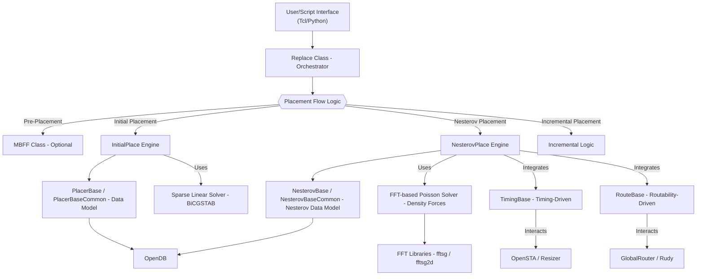
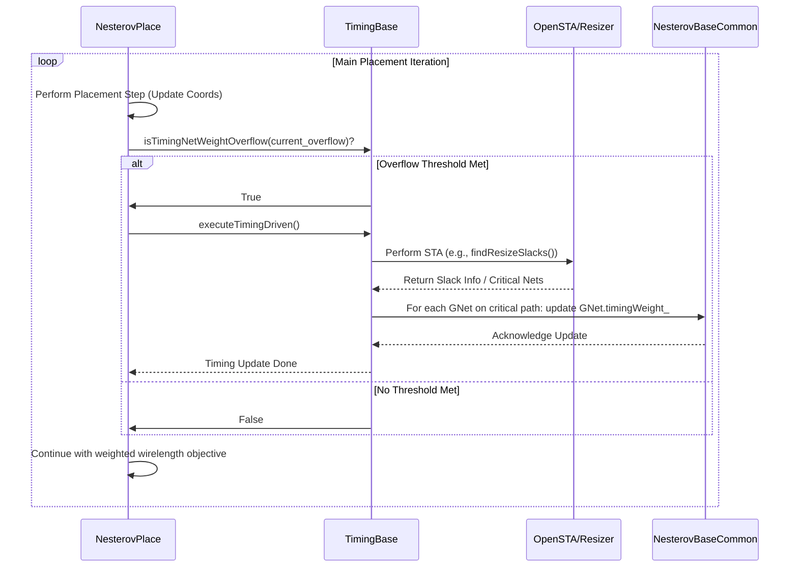
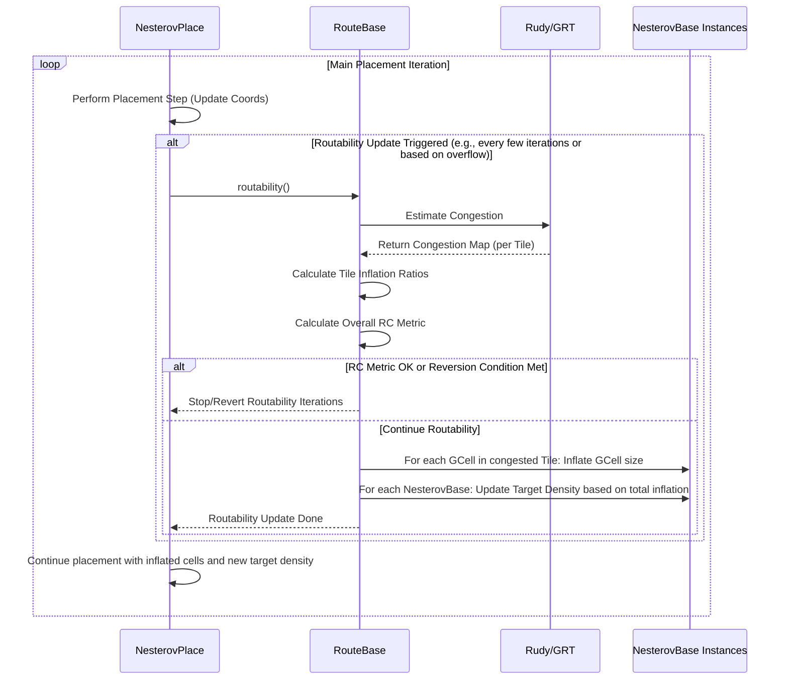
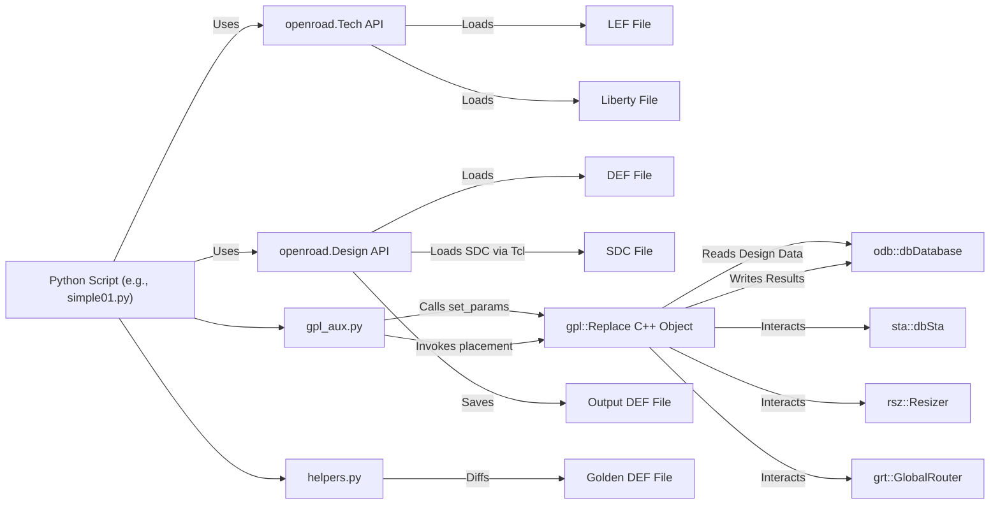
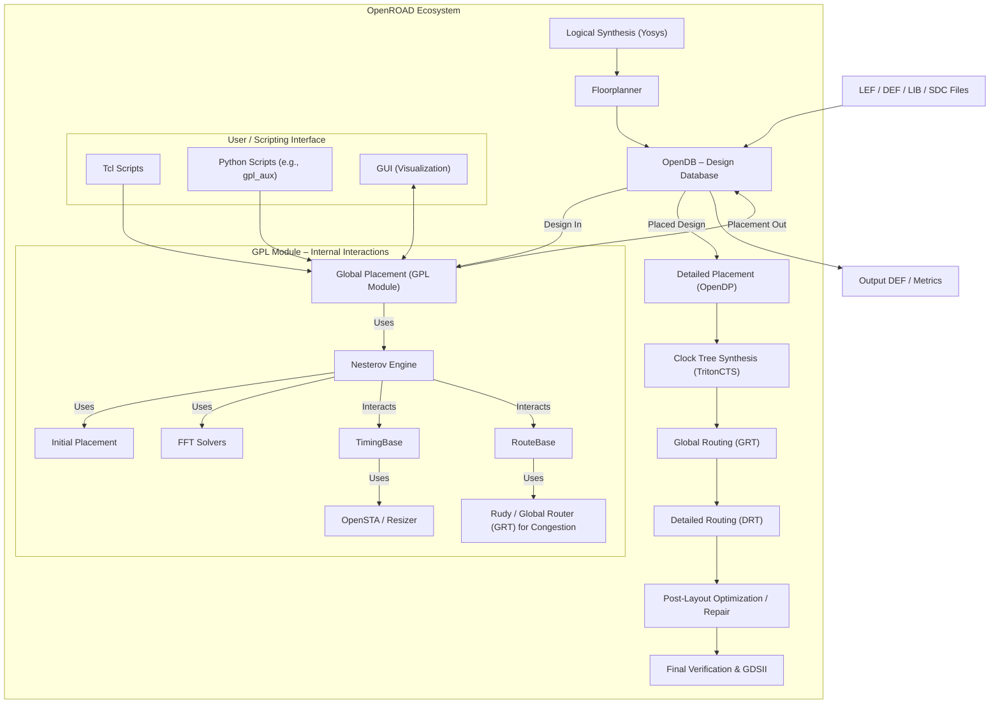

## Table of Contents

1. [Introduction to Global Placement in OpenROAD](#part1_intro)
2. [Core Architecture of the Global Placement Module](#part2_architecture)
3. [Initial Placement Techniques](#part3_initial_placement)
4. [Nesterov-Based Analytical Placement Engine](#part4_nesterov_engine)
5. [Advanced Placement Modes: Timing and Routability](#part5_advanced_modes)
6. [Data Representation and Management in Global Placement](#part6_data_management)
7. [Pre-Placement Optimization: Multi-Bit Flip-Flop (MBFF) Merging](#part7_mbff)
8. [Post-Placement Design Repair and Optimization within GPL's Scope](#part8_design_repair)
9. [Interfacing with the Global Placement Module: Tcl and Python APIs](#part9_interfacing)
10. [Algorithmic Details and Performance Considerations](#part10_algorithms_performance)
11. [Integration of Global Placement within the OpenROAD Ecosystem](#part11_ecosystem_integration)
12. [Visualization and Debugging in Global Placement](#part12_visualization_debug)

## <a id="part1_intro">Part 1 : Introduction to Global Placement in OpenROAD</a>

Global Placement (GPL) is a pivotal stage in the physical design automation flow for Application-Specific Integrated Circuits (ASICs) and Systems-on-Chip (SoCs). Within the OpenROAD project, the GPL module is tasked with determining the initial, coarse-grained positions for all movable instances (standard cells, macros, and other placeable objects) on the chip's core area. This process transforms a logical netlist, often augmented with floorplan constraints, into a physically placed design where every component has an assigned (x, y) coordinate. While these initial positions are not yet fully legalized (i.e., cells may overlap, and are not necessarily aligned to the manufacturing grid), they serve as a crucial foundation for all subsequent physical design steps, including detailed placement, clock tree synthesis, and routing.

The primary objectives of global placement are multifaceted and often involve balancing competing goals:
*   **Wirelength Minimization**: Reducing the total estimated length of interconnects (wires) between connected components. Shorter wires generally lead to improved timing performance, lower power consumption, and better routability. The most common metric for this is Half-Perimeter Wirelength (HPWL).
*   **Cell Density Management**: Distributing cells across the available placement area to avoid excessive local congestion. Overly dense regions can lead to unroutable designs or create hotspots for power and thermal issues. Global placers aim for a relatively uniform distribution, often guided by user-defined target density values.
*   **Routability Enhancement**: Producing a placement that can be successfully routed by subsequent global and detailed routers. This is closely linked to density management but also involves considering the overall cell arrangement and potential blockages.
*   **Timing Awareness (Optional but often crucial)**: In modern designs, meeting timing constraints is paramount. Timing-driven global placement incorporates timing information (e.g., from static timing analysis) to prioritize the placement of cells on critical paths, aiming to reduce delays and improve overall circuit performance.
*   **Congestion Mitigation**: Actively working to reduce areas where the demand for routing resources exceeds supply.

In the OpenROAD flow, global placement typically occurs after logical synthesis (which generates the netlist of standard cells) and floorplanning (which defines the chip's die area, core boundaries, I/O pad locations, and potentially the placement of large macros). The output of the GPL module—a design with globally placed cells—is then consumed by detailed placement tools, which legalize the cell positions (aligning them to rows and sites, removing all overlaps) and perform further local optimizations. Subsequently, routing tools connect the placed components.

The quality of the global placement solution has a profound and cascading impact on the entire physical design backend and, ultimately, on the final chip's Power, Performance, and Area (PPA) characteristics. A well-executed global placement can significantly ease the task for downstream tools, leading to faster design closure and better overall results. Conversely, a suboptimal global placement can create insurmountable challenges for routing and timing, potentially requiring extensive and time-consuming iterations.

OpenROAD's global placement engine is based on robust analytical placement techniques, with its core functionality derived from research and algorithms similar to those found in academic placers like "RePlAce." This approach typically involves formulating the placement problem as a continuous optimization problem, where cell positions are iteratively adjusted to minimize an objective function that combines wirelength and density penalties. The Nesterov optimization method is a key algorithm employed for its efficiency and convergence properties in solving these large-scale, non-linear problems.

The GPL module in OpenROAD is designed to be configurable, allowing users to guide the placement process through various parameters controlling aspects like target density, algorithm iterations, and the enabling of specialized modes such as timing-driven or routability-driven placement. It handles complexities such as pre-placed macros, placement blockages, and can be aware of different placement regions or power domains within the design.

This documentation aims to provide engineers with a comprehensive understanding of the OpenROAD Global Placement module. It will delve into its architecture, the core algorithms employed (including initial placement heuristics and the Nesterov-based analytical engine), data structures used to represent the design during placement, advanced features like timing and routability optimization, methods for interfacing with the module, and considerations for performance and result quality. By understanding the internals and capabilities of the GPL module, engineers can better leverage OpenROAD to achieve high-quality physical design results.

## <a id="part2_architecture">Part 2 : Core Architecture of the Global Placement Module</a>

The Global Placement (GPL) module within OpenROAD is architected as a sophisticated system comprising several key C++ classes and interacting components. This modular design allows for a clear separation of concerns, from high-level orchestration of the placement flow to the implementation of specific optimization algorithms and data management. The architecture is designed to be flexible, supporting various placement strategies and modes, and to integrate seamlessly with other parts of the OpenROAD ecosystem, such as the design database (OpenDB), static timing analysis (OpenSTA), and routing estimation tools.

**Orchestration and Flow Control (`Replace` Class)**

At the highest level, the `Replace` class (found in `Replace.h` and `replace.cpp`) serves as the primary orchestrator and entry point for the global placement engine. Its responsibilities include:

*   **Initialization**: Setting up the placement environment, which involves establishing connections to other OpenROAD modules like OpenDB (`odb::dbDatabase`), OpenSTA (`sta::dbSta`), the Resizer (`rsz::Resizer`), and the Global Router (`grt::GlobalRouter`). It also initializes internal parameters and data structures based on user-provided configurations.
*   **Placement Flow Management**: Defining and executing the sequence of placement operations. This typically involves:
    *   Optional pre-placement optimizations like Multi-Bit Flip-Flop (MBFF) merging.
    *   An **Initial Placement** phase to generate a coarse, globally aware arrangement of cells.
    *   A **Nesterov-based Analytical Placement** phase for iterative refinement, which forms the core of the optimization process.
    *   Support for **Incremental Placement**, allowing refinement of an existing placement or accommodation of engineering change orders (ECOs).
*   **Parameter Configuration**: Exposing a comprehensive set of parameters to the user (often via Tcl commands or Python API, as seen in `gpl_aux.py`). These parameters allow fine-tuning of various aspects of the placement algorithms, such as target density, iteration counts, wirelength coefficients, and modes for timing or routability-driven placement. The `Replace` class uses setter methods to configure these parameters internally.
*   **Multi-Region/Power Domain Handling**: The architecture supports the concept of distinct placement regions, often corresponding to different power domains or user-defined partitions. The `Replace` class manages vectors of `PlacerBase` and `NesterovBase` objects (`pbVec_`, `nbVec_`), allowing each region to have its own context and potentially specialized parameters for placement.
*   **Integration of Specialized Modes**: `Replace` coordinates the activation and operation of timing-driven and routability-driven placement modes by interacting with `TimingBase` and `RouteBase` components, respectively.
*   **State Management**: Includes mechanisms for resetting the placer state for re-runs (`reset()` method) and potentially managing snapshots for robust optimization.

**Data Abstraction and Design Representation (`PlacerBaseCommon` and `PlacerBase` Classes)**

To interface with the OpenDB design database and prepare the design for the placement algorithms, the GPL module uses an abstraction layer primarily defined by the `PlacerBaseCommon` and `PlacerBase` classes (from `placerBase.cpp` and `placerBase.h`):

*   **`PlacerBaseCommon`**:
    *   **Purpose**: Performs the initial, global parsing of the design from OpenDB. It creates and owns the primary representations of `Instance`, `Pin`, and `Net` objects for the entire design.
    *   **Functionality**:
        *   Reads die/core geometry, site dimensions, and power domain information.
        *   Iterates through `odb::dbInst`, `odb::dbBTerm`, `odb::dbITerm`, and `odb::dbNet` objects.
        *   Creates corresponding `gpl::Instance`, `gpl::Pin`, and `gpl::Net` wrapper objects, which are more suitable for placement algorithms.
        *   Maintains maps for efficient lookup between OpenDB objects and their GPL wrapper counterparts.
*   **`PlacerBase`**:
    *   **Purpose**: Builds upon `PlacerBaseCommon` to prepare a specific placement context, often for a sub-region (e.g., a `odb::dbGroup` or a power domain). Its most critical role is identifying and modeling unusable placement sites.
    *   **Functionality**:
        *   Filters instances from `PlacerBaseCommon` relevant to its specific context (e.g., based on group membership, fixed status).
        *   Implements logic to identify unplaceable regions due to placement blockages, fixed macros, fragmented rows, or regions belonging to other power domains. These unusable areas are represented as "dummy" `Instance` objects, treated as fixed obstacles by the placement engine. This simplifies the core placement algorithms by providing a uniform way to handle all non-movable entities.
        *   Maintains lists of movable, fixed, and dummy instances pertinent to its operational context.
*   **Core Data Structures (`Instance`, `Pin`, `Net`, `Die`)**:
    *   **`Instance`**: Represents a placement element (standard cell, macro, or dummy blockage). Stores geometry, fixed/movable status, associated pins, and OpenDB linkage.
    *   **`Pin`**: Represents a connection point (instance terminal or block/chip terminal). Stores coordinates, type, and parent instance/net.
    *   **`Net`**: Represents an electrical net connecting multiple pins. Stores pin lists and calculates HPWL.
    *   **`Die`**: Stores the geometric boundaries of the die and core placement area.

This abstraction layer decouples the core placement algorithms from the intricacies of the OpenDB, providing a cleaner, placement-oriented view of the design.

**Core Placement Engines**

*   **`InitialPlace` Engine**:
    *   Defined in `initialPlace.h` and its implementation.
    *   **Purpose**: To generate a quick, globally-aware initial placement. This often serves as a starting point for the more computationally intensive Nesterov optimization.
    *   **Algorithm**: Typically employs an analytical placement technique, often based on solving a system of linear equations derived from a Bound-to-Bound (B2B) net model to minimize quadratic wirelength. The BiCGSTAB iterative solver (from `solver.cpp`, using the Eigen library) is commonly used for this.
    *   **Interaction**: Configured and invoked by the `Replace` class. It operates on the data structures provided by `PlacerBase`.

*   **`NesterovPlace` Engine and Supporting Base Classes (`NesterovBaseCommon`, `NesterovBase`)**:
    *   The Nesterov-based analytical placement is the workhorse of the GPL module, responsible for high-quality placement refinement. Its architecture is defined in `nesterovBase.h`, `nesterovPlace.h`, and their implementations.
    *   **`NesterovBaseCommon`**: Manages shared data and common functionalities specifically for the Nesterov placer. This includes storing the primary collections of `GCell`, `GNet`, and `GPin` objects (Nesterov-specific representations of cells, nets, and pins), providing mapping functions, and calculating wirelength gradients using the Weighted Average (WA) model. It also handles callbacks for incremental updates from OpenDB.
    *   **`NesterovBase`**: Represents the core Nesterov optimization engine for a specific placement region. It contains a `BinGrid` for density calculation, manages filler cells for density smoothing, and implements the Nesterov optimization loop itself. This involves managing iterative state (coordinates, gradients), calculating density gradients (potentially using FFT-based solvers), updating cell positions, and adjusting density penalty factors.
    *   **`NesterovPlace`**: Orchestrates the overall Nesterov placement process, potentially managing multiple `NesterovBase` instances for different regions. It handles the main iteration loop, dynamic coefficient updates (e.g., `updateWireLengthCoef` based on overflow), snapshotting for divergence control, and final updates to the OpenDB.

**Specialized Mode Handlers**

*   **`TimingBase`**:
    *   Defined in `timingBase.cpp` and its header.
    *   **Purpose**: Manages timing-driven placement logic.
    *   **Functionality**: Interacts with OpenSTA (via `rsz::Resizer`) to obtain slack information for nets. Based on this timing data and configurable overflow thresholds, it calculates timing-based weights for nets. Critical nets receive higher weights, guiding the Nesterov placer to prioritize shortening them.
*   **`RouteBase`**:
    *   Defined in `routeBase.cpp` and its header.
    *   **Purpose**: Manages routability-driven placement optimization.
    *   **Functionality**: Analyzes routing congestion (using Rudy estimator or the Global Router) after a placement iteration. It then "inflates" the size of cells in congested areas, effectively increasing their footprint for the placer. This encourages the placer to spread cells more in these regions in subsequent iterations, improving overall routability. It maintains a `TileGrid` to manage per-tile congestion and inflation ratios.

**Mathematical Foundations and Solvers**

*   **Sparse Linear Solver (`solver.cpp`)**: Implements `cpuSparseSolve` using the Eigen library's BiCGSTAB method. This is crucial for the `InitialPlace` engine to solve `Ax=b` systems derived from quadratic wirelength models. It supports multi-threading via OpenMP.
*   **FFT-Based Poisson Solver (`fft.cpp`, `fftsg2d.cpp`, `fftsg.cpp`)**: The `FFT` class (in `fft.cpp`) uses 2D Discrete Cosine/Sine Transforms (DCT/DST), implemented by `fftsg2d.cpp` (which in turn relies on 1D FFTs from `fftsg.cpp`), to efficiently solve Poisson's equation. This is a common technique in analytical placers (like the Nesterov engine) to model cell density as a continuous function and calculate electrostatic-like forces for cell spreading. These forces help to reduce cell overlaps and achieve target densities.

**High-Level Component Interaction Diagram (Mermaid)**

This architectural overview shows a highly modular yet interconnected system. The `Replace` class acts as the central coordinator, leveraging specialized engines for initial and Nesterov placement, and integrating with data abstraction layers that communicate with the core OpenDB. The Nesterov engine, in turn, can be augmented by timing and routability handlers and relies on sophisticated mathematical solvers for its core operations. This structure provides both robustness and flexibility for tackling the complex challenge of global placement.

## <a id="part3_initial_placement">Part 3 : Initial Placement Techniques</a>

Initial Placement (IP) is a critical preliminary step within the global placement flow. Its primary objective is to generate a coarse, but globally aware, distribution of all movable instances (standard cells and macros) across the chip's core area. While this initial placement is generally not expected to be legal (i.e., cells may overlap significantly, and are not aligned to sites), it serves as a crucial starting point for subsequent, more computationally intensive optimization algorithms like Nesterov-based analytical placement. A well-executed initial placement can significantly improve the convergence speed, stability, and final quality of results (QoR) of the overall global placement process. Poor initial placement can lead to slower convergence, trap the optimizer in local minima, or even cause divergence.

Within OpenROAD's Global Placement (GPL) module, the `InitialPlace` class (defined in `initialPlace.h` and its corresponding `.cpp` file) is primarily responsible for this phase. The dominant technique employed is an analytical method based on solving a system of linear equations derived from a wirelength model, typically a quadratic wirelength model.

**Underlying Principle: Force-Directed Placement and Quadratic Wirelength Minimization**

The core idea behind many initial placement techniques, including the one in OpenROAD, draws from force-directed placement. Imagine nets as springs connecting their associated pins. The goal is to find cell positions where the "energy" of this system of springs is minimized.

If we model the wirelength of each net quadratically (e.g., sum of squared distances between connected pins), the total wirelength objective function becomes a quadratic function of the cell coordinates. The minimum of a quadratic function can be found by setting its first derivative to zero. This mathematical operation results in a system of linear equations:

`Ax = b`

Where:
*   `x` is a vector representing the unknown (x or y) coordinates of all movable cells.
*   `A` is a sparse matrix (often called the connectivity or Laplacian matrix) whose entries depend on the netlist connectivity and the weights assigned to nets. Each row corresponds to a movable cell, and non-zero entries appear for cells connected by common nets.
*   `b` is a vector representing the influence of fixed elements in the design. These fixed elements include I/O pins/pads, fixed macros, and potentially pre-placed cells. Their fixed positions exert a "pull" on the movable cells they connect to.

Separate systems of equations are typically solved for the X and Y dimensions independently.

**Key Algorithmic Steps in OpenROAD's `InitialPlace`:**

1.  **Data Preparation (`PlacerBase` and `PlacerBaseCommon`):**
    *   Before `InitialPlace` can operate, the `PlacerBaseCommon` and `PlacerBase` objects must have processed the design from OpenDB. This involves:
        *   Identifying all `Instance` objects (movable cells, fixed macros, dummy blockages).
        *   Identifying all `Pin` objects and their parent `Instance` and `Net`.
        *   Identifying all `Net` objects and their constituent `Pin`s.
        *   Defining the `Die` and core area boundaries.
    *   Crucially, `PlacerBase` identifies unplaceable regions and models them as dummy fixed instances, which will contribute to the `b` vector in the linear system.

2.  **Instance Categorization and Indexing (`setPlaceInstExtId`):**
    *   Movable instances (those to be placed by `InitialPlace`) are assigned unique internal IDs. These IDs are used as indices for constructing the matrix `A` and vectors `x` and `b`. Fixed instances are also identified as they contribute to the `b` vector.

3.  **Initial Location Guess (Optional, e.g., `placeInstsCenter`):**
    *   While the solver finds the optimal solution based on the linear system, providing an initial guess for cell locations (e.g., placing all movable cells at the die center) can sometimes be part of the setup, although the BiCGSTAB solver can start from a zero vector. This step might also be where cell locations are initialized if `skip_initial_place` is enabled in higher-level scripts, meaning `InitialPlace` refines pre-existing coordinates.

4.  **Sparse Matrix Construction (`createSparseMatrix`):**
    *   This is the core of formulating the linear system. The `InitialPlace` engine iterates through each net in the design.
    *   **Net Modeling (Bound-to-Bound - B2B):** A common approach for multi-pin nets in quadratic placers is the Bound-to-Bound (B2B) model. For a net connecting pins `p_1, p_2, ..., p_k`, the B2B model effectively creates a clique of "springs" connecting every pair of pins within that net. The contribution of a single net to the quadratic wirelength objective for one dimension (e.g., X) can be expressed as:
        `WL_net_X = w_net * sum_{i<j} (x_i - x_j)^2`
        where `w_net` is the weight of the net (can be scaled based on timing criticality or other factors, though `InitialPlace` often uses unit weights or simple fanout-based weighting as configured by `InitialPlaceVars::netWeightScale`).
    *   **Matrix `A` Population:** When the derivative of this quadratic wirelength objective is taken with respect to the coordinate of a movable cell `c`, it leads to terms that populate the row corresponding to cell `c` in matrix `A`.
        *   The diagonal element `A_cc` for cell `c` will accumulate terms representing the sum of "spring stiffnesses" connected to cell `c`.
        *   Off-diagonal elements `A_cd` (where `d` is another movable cell connected to `c` by a net) will typically be negative, representing the attractive force between `c` and `d`.
    *   **Vector `b` Population:** For each net that connects a movable cell `c` to a fixed pin (belonging to a fixed macro or an I/O pad), the fixed pin's coordinate contributes to the `b_c` entry in the `b` vector. This represents the "pull" from the fixed elements.
    *   The `placeInstForceMatrixX_` and `placeInstForceMatrixY_` (Eigen sparse matrices) are constructed for X and Y dimensions, respectively. Similarly, `fixedInstForceVecX_` and `fixedInstForceVecY_` are populated.
    *   Net weighting (`InitialPlaceVars::netWeightScale`, `InitialPlaceVars::maxFanout`) can influence the magnitude of contributions to `A` and `b`, allowing some nets to have a stronger influence on the placement.

5.  **Solving the Linear System (`doBicgstabPlace` and `solver::cpuSparseSolve`):**
    *   Once `A` and `b` are constructed for both X and Y dimensions, the system `Ax = b` is solved.
    *   OpenROAD uses the **BiConjugate Gradient Stabilized (BiCGSTAB)** method, an iterative solver well-suited for large, sparse, and potentially non-symmetric (though placement matrices are often symmetric positive-definite) linear systems.
    *   The `solver::cpuSparseSolve` function (in `solver.cpp`) encapsulates the call to the Eigen library's BiCGSTAB implementation. Eigen is a high-performance C++ template library for linear algebra.
    *   The solver iteratively refines the solution vectors `instLocVecX_` and `instLocVecY_` (which initially might hold zeros or a starting guess) until a convergence criterion (e.g., residual error tolerance) is met or the maximum number of solver iterations (`InitialPlaceVars::maxSolverIter`) is reached.
    *   The solver can leverage multi-threading (OpenMP) if enabled, as Eigen's BiCGSTAB can parallelize many of its internal computations.

6.  **Updating Instance Coordinates (`updateCoordi`):**
    *   After the solver converges, the resulting `instLocVecX_` and `instLocVecY_` contain the optimal coordinates for the movable instances according to the quadratic wirelength model.
    *   These coordinates are then written back to the `gpl::Instance` objects, and subsequently, can be used to update the actual `odb::dbInst` locations in the OpenDB database.

**Configuration Parameters (`InitialPlaceVars`):**

The behavior of `InitialPlace` is controlled by parameters defined in `InitialPlaceVars`:
*   `maxIter`: Maximum iterations for the overall initial placement process (though for a single solve, this might relate to outer loops not detailed here, or simply be unused if one solve is sufficient).
*   `minDiffLength`: A convergence criterion based on the change in total wirelength or average cell movement between iterations (if iterative refinement around the solve is used).
*   `maxSolverIter`: Maximum iterations for the BiCGSTAB solver itself. Crucial for managing runtime and ensuring the solver doesn't run indefinitely if convergence is slow.
*   `maxFanout`: A threshold for net fanout. Nets with fanout greater than this might be ignored or weighted differently to reduce computational complexity or improve numerical stability, as very high fanout nets can dominate the matrix.
*   `netWeightScale`: A global scaling factor applied to net weights, influencing the overall "stiffness" of the spring system.
*   `debug`: Enables debug output for diagnostics.

**Strengths and Limitations of this Initial Placement Technique:**

*   **Strengths:**
    *   **Global View:** Analytical solvers inherently consider the global connectivity of the design, leading to placements that are generally good from a wirelength perspective.
    *   **Speed:** For a single solve, especially with efficient sparse matrix libraries, it can be relatively fast compared to more complex iterative methods.
    *   **Foundation:** Provides a good, non-trivial starting point that helps the Nesterov placer converge more quickly and reliably.
*   **Limitations:**
    *   **Cell Overlap:** The pure quadratic wirelength minimization does not explicitly prevent cell overlaps. The resulting placement will almost certainly have significant overlaps.
    *   **Density Control:** It has no inherent mechanism for controlling cell density distribution. Cells tend to cluster towards the center of gravity of their connections.
    *   **HPWL Discrepancy:** Minimizing quadratic wirelength is not exactly the same as minimizing HPWL (the more standard metric). However, it's a good proxy that leads to differentiable objective functions.

The output of `InitialPlace` is thus a "spread-out" but heavily overlapping placement. This is then passed to the Nesterov placer, which uses more sophisticated techniques to manage density and resolve overlaps while further optimizing wirelength and other objectives. If the `skip_initial_place` option is used in higher-level scripts (like the Python test scripts), it often implies that the design already has some initial coordinates, and the subsequent Nesterov stage will attempt to refine these directly, bypassing this specific `InitialPlace` solve.

## <a id="part4_nesterov_engine">Part 4 : Nesterov-Based Analytical Placement Engine</a>

The Nesterov-based analytical placement engine is the cornerstone of OpenROAD's global placement capability, responsible for iteratively refining cell positions to achieve a high-quality layout. This engine addresses the limitations of simpler initial placement techniques by simultaneously optimizing for wirelength and managing cell density to produce a spread-out, routable placement. It employs Nesterov's accelerated gradient (NAG) method, a sophisticated optimization algorithm known for its fast convergence properties in solving large-scale, non-linear optimization problems common in VLSI placement.

The core C++ classes involved in this engine are `NesterovPlace` (orchestrator, in `nesterovPlace.h/cpp`), `NesterovBase` (regional engine, in `nesterovBase.h/cpp`), and `NesterovBaseCommon` (shared data, also in `nesterovBase.h/cpp`). These interact with specialized data structures like `GCell`, `GPin`, `GNet`, and `BinGrid`.

**Underlying Principle: Non-Linear Optimization**

Unlike the quadratic model of `InitialPlace`, the Nesterov engine typically minimizes a more complex, non-linear objective function. This objective function usually comprises two main components:

1.  **Wirelength Cost (`W(x,y)`):** A smooth, differentiable approximation of the Half-Perimeter Wirelength (HPWL). Common models include:
    *   **Weighted Average (WA) Wirelength Model:** (e.g., from ePlace-MS) This model is extensively used in OpenROAD. For each net, it calculates a "center of gravity" based on the exponential weighting of its pins' locations. The wirelength is then the sum of weighted distances of pins from this net-specific center. This provides a smooth and differentiable alternative to the non-smooth HPWL.
    *   Log-Sum-Exp (LSE) or other smoothing functions for HPWL.

2.  **Density Cost (`D(x,y)`):** A penalty term that quantifies cell overlaps and uneven density distribution. This term encourages cells to spread out and helps achieve target utilization across the placement area.

The total objective function `F(x,y)` is a weighted sum of these components:
`F(x,y) = W(x,y) + Φ * D(x,y)`
Where `Φ` (Phi) is a dynamically adjusted penalty factor that controls the relative importance of density versus wirelength during different stages of the optimization.

The Nesterov algorithm iteratively computes the gradient of `F(x,y)` with respect to cell coordinates `(x,y)` and updates these coordinates to minimize `F`.

**Architectural Components and Their Roles:**

*   **`NesterovBaseCommon`**:
    *   **Central Data Repository**: Manages the primary collections of Nesterov-specific placement objects:
        *   `gCellStor_`: Stores `GCell` objects, representing standard cells, macros, or filler cells.
        *   `gNetStor_`: Stores `GNet` objects.
        *   `gPinStor_`: Stores `GPin` objects.
    *   **Mapping**: Provides efficient mapping from OpenDB objects (`odb::dbInst`, `odb::dbNet`, etc.) or `PlacerBase` objects to their `GCell`, `GNet`, `GPin` counterparts and their indices. This is crucial for initializing the Nesterov placer's internal state from the broader design database.
    *   **Wirelength Gradient Calculation**: Implements the logic for calculating the wirelength component of the gradient (`∇W`) using the Weighted Average model. This involves accumulating sums and partial derivatives for each pin and net.
    *   **Incremental Updates**: Handles callbacks (`nesterovDbCbk`) from OpenDB for changes like cell creation, deletion, or resizing, allowing for incremental updates to the Nesterov placer's data structures. This is vital for flows involving ECOs or iterative design modifications.

*   **`GCell`, `GPin`, `GNet` (Global Placement Objects)**:
    *   **`GCell`**: Represents a placeable entity.
        *   Stores physical coordinates (`lx_`, `ly_`, `ux_`, `uy_`) and "density" coordinates (often scaled or adjusted for density calculations).
        *   Tracks its current gradient (`gradientX_`, `gradientY_`), which is the sum of wirelength and density forces acting on it.
        *   Holds pointers to its associated `GPin`s.
        *   Can be a standard cell instance, a macro (often treated as fixed or having special handling), or a "filler" cell. Filler cells are abstract entities used to represent whitespace and help achieve target density by contributing to bin density calculations.
        *   Maintains status: movable, fixed, or locked.
    *   **`GPin`**: Represents a connection point on a `GCell`.
        *   Links a `GCell` to a `GNet`.
        *   Stores its own coordinates, derived from its parent `GCell`'s location and an offset (from the cell's master definition).
        *   Contains data members crucial for the Weighted Average wirelength model, such as `sumExpPoint_`, `sumExpGrad_`, which are intermediate terms for calculating the net's center of gravity and the pin's contribution to the wirelength gradient.
    *   **`GNet`**: Represents an electrical net.
        *   Maintains a list of its `GPin`s.
        *   Calculates its bounding box and HPWL (for reporting and potentially for hybrid wirelength models).
        *   Stores `timingWeight_` and `customWeight_`, allowing the placer to prioritize certain nets (e.g., critical nets from timing analysis).
        *   Contains WA model variables like `totalWeight_`, `lowerBound_`, `upperBound_`, `curWAExpMinSum_`, `curWAExpMaxSum_`, which are aggregates used in the WA wirelength calculation for that net.

*   **`BinGrid` and `Bin`**:
    *   **`Bin`**: Represents a rectangular region (a bin) in a 2D grid covering the placement area.
        *   Stores its geometric boundaries.
        *   Accumulates area information: total available area, non-placeable area (due to blockages), instance-occupied area (from `GCell`s whose centers fall within the bin), and filler cell area.
        *   Maintains its target density and calculates its actual (current) density.
        *   Stores electrostatic potential (`electroPhi_`) and force components (`electroForceX_`, `electroForceY_`). These are derived from the density distribution and model the "repulsive" forces that help spread cells.
    *   **`BinGrid`**: Manages a 2D array of `Bin` objects.
        *   Initializes all bins based on die/core boundaries and `NesterovPlaceVars::binGridCntX/Y`.
        *   `updateBins()`: Iteratively updates the density of each bin by summing the areas of `GCell`s and filler cells overlapping it. Calculates total overflow area (sum of (actual density - target density) * bin area, for overfilled bins).
        *   Plays a central role in deriving the density gradient (`∇D`).

*   **`NesterovBase` (Regional Nesterov Engine)**:
    *   **Context-Specific Engine**: Typically instantiated for each distinct placement region or power domain. This allows for tailored optimization within specific parts of the chip.
    *   **Data Management**: Manages `GCell`s specific to its region, including a separate store for filler cells (`fillerStor_`) used to achieve uniform density.
    *   **Density Calculation and Force Generation**:
        *   Owns a `BinGrid` (`bg_`) for its region.
        *   Optionally uses an `FFT` object (`fft_`, from `fft.cpp`). If enabled, this `FFT` object solves Poisson's equation (`∇²Φ = -ρ_eff`, where `ρ_eff` is related to (actual density - target density)) using 2D DCT/DST.
        *   The solution `Φ` (electrostatic potential) is stored in each `Bin`.
        *   The electric field `E = -∇Φ` is then calculated, yielding `electroForceX_` and `electroForceY_` for each bin. These forces represent the density gradient component.
        *   If FFT is not used, density gradients might be computed using simpler methods based on local bin density differences.
    *   **Nesterov Optimization Loop (Core Logic)**:
        *   `initDensity1()`, `initDensity2()`: Initialize density-related parameters, possibly involving initial filler cell placement.
        *   **Iterative State**: Maintains several vectors (indexed by `GCell` ID) storing coordinates and gradients for different steps of the Nesterov algorithm:
            *   `curCoordi_`: Current cell coordinates.
            *   `curSLPCoordi_`, `curSLPSumGrads_`: Step Length Prediction coordinates and sum of gradients. This is the "lookahead" point in NAG.
            *   `nextSLPCoordi_`, `nextSLPWireGrad_`, `nextSLPDensGrad_`: Wirelength and density gradients calculated at the SLP coordinates for the next iteration.
            *   `prevSLPCoordi_`, `prevSLPSumGrads_`: State from the previous iteration, used for momentum calculation.
        *   `getStepLength()`: Calculates the step length (`alpha_k`) for the current iteration, crucial for NAG.
        *   `nesterovUpdateCoordinates()`: Updates cell coordinates using the NAG formula:
            `x_{k+1} = y_k - alpha_k * ∇F(y_k)`
            `y_{k+1} = x_{k+1} + beta_k * (x_{k+1} - x_k)` (where `beta_k` is the momentum term)
            The actual implementation involves the SLP points.
        *   `nesterovUpdateStepLength()`: Updates the step length for the next iteration.
        *   `nesterovAdjustPhi()`: Dynamically adjusts the density penalty factor `phi_` based on the current overflow. If overflow is high, `phi_` increases to prioritize spreading. If overflow is low, `phi_` decreases to allow more focus on wirelength.
        *   **Convergence/Divergence Handling**: Monitors metrics like HPWL and overflow. If optimization diverges (e.g., HPWL increases too much), it might revert to a previous good state (snapshot).
    *   **Area Accounting**: Tracks movable area, fixed area, and filler cell area within its region.

*   **`NesterovPlace` (Global Nesterov Orchestrator)**:
    *   **Initialization (`init()` and `initNesterovPlace` in `Replace` class)**:
        *   Sets up `NesterovBaseCommon` by creating `GCell`, `GPin`, `GNet` objects from `PlacerBase` data.
        *   Initializes `NesterovBase` instances for each placement region.
        *   If timing-driven, initializes `TimingBase` which then interacts with OpenSTA.
        *   If routability-driven, initializes `RouteBase` which can interact with Rudy or GRT.
    *   **Main Optimization Loop (`doNesterovPlace`)**:
        1.  Iterates for a user-defined number of iterations (`NesterovPlaceVars::maxNesterovIter`) or until convergence.
        2.  **Gradient Calculation**:
            *   `updateNextGradient()`:
                *   Calculates wirelength gradients (`nextSLPWireGrad_`) for all `GCell`s using `NesterovBaseCommon::updateGCellGradWA()`.
                *   Calls `updateDensityGrad()` on each `NesterovBase` instance. This involves:
                    *   Updating bin densities based on current `nextSLPCoordi_`.
                    *   Using the FFT solver (if enabled) to calculate potential and density forces.
                    *   Assigning `nextSLPDensGrad_` to `GCell`s based on the density forces of the bins they occupy.
        3.  **Coordinate Update**: Calls `nesterovUpdateCoordinates()` on each `NesterovBase` instance to update cell positions using the calculated gradients and NAG formulas.
        4.  **Phi Coefficient Update**: Calls `updatePhi()` which internally calls `nesterovAdjustPhi()` on each `NesterovBase` to adjust the density penalty based on current overflow. The `phi_` value typically increases if overflow is high and decreases if overflow is low, balancing wirelength and density objectives.
        5.  **Step Length Update**: Calls `nesterovUpdateStepLength()` on each `NesterovBase`.
        6.  **State Update**: `updateCurGradient()`, `updatePrevGradient()` shift gradient and coordinate information for the next iteration.
        7.  **Wirelength Coefficient Update (`updateWireLengthCoef`)**: Dynamically adjusts the overall wirelength coefficient (`wireLengthCoefX_`, `wireLengthCoefY_`) based on the total overflow. If overflow is high, wirelength might be de-emphasized to allow for more spreading.
        8.  **Timing/Routability Updates (Conditional)**:
            *   If timing-driven mode is active, `TimingBase::executeTimingDriven()` is called periodically (e.g., based on overflow thresholds like `timing_driven_net_reweight_overflow`) to update net weights.
            *   If routability-driven mode is active, `RouteBase::routability()` is called periodically to perform cell inflation based on congestion.
        9.  **Convergence Check**: Monitors HPWL, overflow, and cell movement. Terminates if changes are below thresholds or max iterations are reached.
        10. **Snapshotting and Reversion**: `NesterovPlace` has logic to save snapshots of good placement states (low HPWL, low overflow). If the optimization diverges (e.g., HPWL increases significantly), it can revert to a previously saved snapshot to ensure stability.
    *   **Database Update (`updateDb`)**: After convergence, updates the actual cell locations in OpenDB with the final `GCell` positions.

**Key Parameters (`NesterovPlaceVars` and `NesterovBaseVars`):**

*   `targetDensity`, `targetOverflow`: Guide density management.
*   `binGridCntX`, `binGridCntY`: Define the granularity of the density grid.
*   `minPhiCoef`, `maxPhiCoef`, `initialDensityPenalty (init_phi_coef)`: Control the density penalty factor `Φ`.
*   `initWireLengthCoef`, `refHpwl`: Influence the wirelength term.
*   `maxNesterovIter`: Maximum placement iterations.
*   Flags for `timingDrivenMode`, `routability_driven_mode`, `useUniformView`, `usePlot`, etc.

**Algorithm Flow Summary (Simplified Nesterov Iteration):**

1.  **Initialize**:
    *   Create `GCell`s, `GNet`s, `GPin`s.
    *   Set initial cell positions (e.g., from `InitialPlace` or input DEF).
    *   Initialize `phi_` (density penalty).
2.  **Loop (Main Iteration `k`)**:
    a.  **Calculate Step Length Prediction (SLP) points (`y_k`)**: Based on current and previous coordinates and gradients (momentum step).
    b.  **Calculate Gradients at SLP**:
        i.  Wirelength Gradient (`∇W(y_k)`): Using Weighted Average model.
        ii. Density Gradient (`∇D(y_k)`):
            1.  Update bin densities based on `y_k`.
            2.  Solve Poisson's equation (FFT) to get potential field.
            3.  Compute density forces (gradient of potential).
    c.  **Combine Gradients**: `∇F(y_k) = ∇W(y_k) + phi_ * ∇D(y_k)`.
    d.  **Update Cell Coordinates (`x_{k+1}`):** Move cells based on `∇F(y_k)` and current step length (`alpha_k`).
    e.  **Update `phi_`**: Adjust based on current cell overflow. If overflow high, increase `phi_`.
    f.  **Update Step Length and Momentum Terms**: For next iteration.
    g.  **Check Convergence/Termination**: If converged or max iterations, exit. Else, `k = k+1`, go to Loop.
3.  **Finalize**: Update OpenDB with final cell positions.

This Nesterov-based engine provides a powerful and flexible framework for global placement, capable of handling large designs and producing high-quality results by effectively balancing wirelength optimization with cell density management, and optionally incorporating timing and routability considerations.

## <a id="part5_advanced_modes">Part 5 : Advanced Placement Modes: Timing and Routability</a>

While minimizing wirelength and managing cell density are fundamental objectives of global placement, modern System-on-Chip (SoC) designs demand more. Achieving timing closure and ensuring a routable design are equally, if not more, critical. OpenROAD's Global Placement (GPL) module incorporates advanced modes to address these concerns: **Timing-Driven Placement** and **Routability-Driven Placement**. These modes augment the core Nesterov-based optimization by introducing additional considerations and feedback loops into the placement process.

The `Replace` class orchestrates the activation of these modes, which are primarily implemented by the `TimingBase` and `RouteBase` classes, respectively. These classes interact closely with the `NesterovPlace` and `NesterovBase` engines.

**Timing-Driven Placement**

The goal of timing-driven placement is to arrange cells in a way that helps meet the design's timing constraints, primarily by reducing the delay of critical paths. This is achieved not by directly optimizing for timing (which is a complex, non-linear problem for a global placer) but by influencing the wirelength optimization to favor nets on critical paths.

**Core Mechanism: Net Weighting**

*   **`TimingBase` Class (`timingBase.cpp`, `timingBase.h`)**: This class is central to timing-driven placement.
    *   **Dependencies**: It requires access to `NesterovBaseCommon` (to access and modify `GNet` objects) and, crucially, an instance of `rsz::Resizer` (from OpenSTA, OpenROAD's Static Timing Analyzer). The `Resizer` object provides the interface to perform timing analysis and retrieve slack information.
    *   **Activation Trigger**: Timing-driven updates are not necessarily performed at every placement iteration. Instead, `TimingBase` uses a set of "overflow" thresholds (`timingNetWeightOverflow_`). These thresholds typically relate to metrics like HPWL overflow compared to a reference, or a measure of placement perturbation. When the current placement's overflow metric crosses one of these predefined thresholds (and hasn't been triggered for that threshold in the current phase), `TimingBase::isTimingNetWeightOverflow()` signals that a timing update is needed. This prevents excessive STA calls, which can be computationally expensive.
    *   **Core Function (`TimingBase::executeTimingDriven`)**:
        1.  **Static Timing Analysis (STA)**: Invokes `rs_->findResizeSlacks()` (or a similar Resizer API call). This triggers OpenSTA to perform a timing analysis based on the current cell locations (which influences estimated net parasitics) and the design's SDC (Synopsys Design Constraints).
        2.  **Critical Path Identification**: Retrieves information about the worst-slack nets or a certain percentage of the most critical nets from the Resizer/STA.
        3.  **Net Weight Calculation**: For each `GNet` in the design:
            *   Its `timingWeight_` is initialized (e.g., to 1.0).
            *   If a net is identified as critical (i.e., its slack is below a certain threshold, often derived from the distribution of slacks of the `worst_slack_nets`), its `timingWeight_` is increased.
            *   The weighting scheme is typically a linear interpolation:
                `weight = 1.0 + (net_weight_max_ - 1.0) * (slack_max - net_slack) / (slack_max - slack_min)`
                Where:
                *   `net_weight_max_`: A user-configurable maximum weight (e.g., 2.0, 4.0).
                *   `slack_min`: Slack of the most timing-critical net considered for re-weighting.
                *   `slack_max`: Slack of the "least critical" net among those being actively re-weighted (e.g., the slack of the Nth percentile net).
                Nets with slack worse than `slack_min` get `net_weight_max_`; nets with slack better than or equal to `slack_max` (but still critical enough to be in the considered set) get a weight of 1.0; nets in between get a proportionally scaled weight.
        4.  **Updating `GNet` Objects**: The calculated `timingWeight_` is applied to the corresponding `GNet` object within `NesterovBaseCommon`.
*   **Impact on Nesterov Placer**: The Nesterov engine's wirelength objective function (e.g., Weighted Average model) incorporates these net weights. A net with a higher `timingWeight_` will contribute more to the wirelength cost and its gradient. Consequently, the placer will exert more effort to shorten this net (by pulling its connected `GCell`s closer), even if it slightly compromises the wirelength of less critical nets or overall HPWL.
*   **Configuration Parameters (`NesterovPlaceVars` related to timing)**:
    *   `timingDrivenMode`: Boolean flag to enable/disable this mode.
    *   `timing_driven_net_reweight_overflow`: Vector of integer percentages acting as thresholds to trigger STA and re-weighting.
    *   `timing_driven_net_weight_max`: The `net_weight_max_` used in the weighting formula.
    *   `timing_driven_nets_percentage`: Potentially influences how many of the "worst" nets are considered for aggressive re-weighting.

**Interaction Flow for Timing-Driven Placement:**

**Routability-Driven Placement**

The objective of routability-driven placement is to produce a layout that is easier for subsequent global and detailed routers to wire, minimizing routing congestion and reducing the likelihood of unroutable nets or design rule violations (DRCs). This is primarily achieved by intelligently spreading cells in areas prone to congestion.

**Core Mechanism: Cell Inflation and Target Density Adjustment**

*   **`RouteBase` Class (`routeBase.cpp`, `routeBase.h`)**: This class implements the logic for routability optimization.
    *   **Dependencies**: It requires access to `NesterovBaseCommon` and `NesterovBase` instances (to modify `GCell` sizes and placer's target density) and interfaces with congestion estimation tools:
        *   Rudy: A fast, approximate routing congestion estimator.
        *   Global Router (`grt::GlobalRouter`): Can provide more accurate congestion feedback, potentially by performing a trial global route.
    *   **`TileGrid` and `Tile`**: `RouteBase` uses a `TileGrid` structure, which divides the placement area into a grid of `Tile`s (conceptually similar to GCells in routing). Each `Tile` stores routing usage, capacity, and calculated congestion information.
    *   **Core Function (`RouteBase::routability`)**: This function is typically called periodically during the Nesterov placement iterations.
        1.  **Congestion Estimation**:
            *   Calls `getRudyResult()` or `getGrtResult()` based on `RouteBaseVars::useRudy`.
            *   `updateRudyRoute()` / `updateGrtRoute()`: These internal methods populate the `TileGrid` with congestion data.
                *   Rudy provides direct congestion values per tile.
                *   For GRT, it queries the GCell grid from OpenDB (`odb::dbBlock::getGCellGrid()`) to get horizontal/vertical usage and capacity for each routing edge associated with a tile. It considers blockages and cleverly sums edge congestion for adjacent tiles to derive a per-tile congestion metric (`ratio`).
            *   The `inflationRatio_` for each `Tile` is calculated based on its congestion `ratio`, using a formula like `pow(congestion_ratio, inflationRatioCoef)`, capped by `maxInflationRatio`.
        2.  **Routing Congestion (RC) Metric Calculation**:
            *   `getRudyRC()` / `getGrtRC()`: Calculates a single RC metric representing the overall design routability. This is often a weighted average of the highest congestion values (e.g., top 0.5%, 1%, 2%, 5% congested tiles/edges), using weights `rcK1` to `rcK4`.
        3.  **Termination/Reversion Logic**:
            *   If current `curRc` is below `RouteBaseVars::targetRC`, routability is considered achieved, and the process might stop or reduce intensity.
            *   It tracks the minimum RC achieved (`minRc_`). If `curRc` starts to degrade for several iterations (`minRcViolatedCnt_`), it may revert cell sizes and target density to the state that produced the best `minRc_`. This prevents over-inflation or divergence.
        4.  **Cell Inflation (Bloating)**:
            *   Iterates through all movable `GCell`s.
            *   Determines the `Tile` in the `TileGrid` that the `GCell`'s center belongs to.
            *   If the `Tile`'s `inflatedRatio_` (copied from `inflationRatio_` if it's effective) is greater than 1.0, the `GCell`'s dimensions (`dx_`, `dy_`) are increased by a factor, typically `sqrt(inflatedRatio_)`. This makes the cell appear larger to the Nesterov placer.
            *   The total change in cell area due to inflation (`inflatedAreaDelta_`) is accumulated.
        5.  **Target Density Update**:
            *   The increased area of inflated cells means the overall movable cell area has increased. To maintain a physically realizable placement, the target density for the Nesterov placer instances (`NesterovBase::updateTargetDensity()`) is adjusted upwards to reflect this `inflatedAreaDelta_`.
        6.  **Constraint Check**: If the new effective target density (considering core area and inflated cell area) exceeds `RouteBaseVars::maxDensity`, the process might revert and terminate.
        7.  **Feedback to Nesterov Placer**: The Nesterov placer, in its subsequent iterations, will see these larger ("bloated") `GCell`s and the adjusted (higher) target density. This forces it to allocate more space to cells in previously congested regions, effectively spreading them out.
*   **Configuration Parameters (`NesterovPlaceVars` and `RouteBaseVars` related to routability)**:
    *   `routabilityDrivenMode`: Boolean flag to enable/disable.
    *   `useRudy`: Selects between Rudy and GRT for congestion estimation.
    *   `inflationRatioCoef`, `maxInflationRatio`, `minInflationRatio`: Control the cell inflation calculation.
    *   `maxDensity`: Upper limit for placement density after inflation.
    *   `targetRC`: Target routing congestion metric for termination.
    *   `rcK1`, `rcK2`, `rcK3`, `rcK4`: Weights for calculating the RC metric.

**Interaction Flow for Routability-Driven Placement:**

**Synergy and Trade-offs:**

Timing-driven and routability-driven modes can operate concurrently. However, their objectives can sometimes conflict:
*   Timing optimization often wants to pull critical cells closer, potentially increasing local density.
*   Routability optimization wants to spread cells in congested areas, which might lengthen some nets, including potentially critical ones.

The Nesterov placer, along with the dynamic adjustment of `phi_` (density penalty) and `wireLengthCoef`, attempts to find a balanced solution. The periodic nature of these advanced mode updates allows the core Nesterov algorithm to stabilize before new constraints (weighted nets or inflated cells) are introduced. The success of these modes heavily depends on accurate feedback from STA and congestion estimation tools, and careful tuning of their respective parameters. These advanced modes transform the global placer from a purely geometric optimizer into a more holistic tool that considers critical downstream design objectives.

## <a id="part6_data_management">Part 6 : Data Representation and Management in Global Placement</a>

Effective global placement relies on an efficient and accurate representation of the chip design. The OpenROAD Global Placement (GPL) module employs a hierarchy of C++ classes and data structures to model the various physical and logical entities of a design. These structures abstract information from the primary OpenDB database, transforming it into a format more amenable to the specific needs of placement algorithms. This section details these key data representations and how they are managed throughout the global placement process.

**Core Data Abstraction Layer (`PlacerBaseCommon`, `PlacerBase`)**

The foundation for representing the design within GPL is laid by the `PlacerBaseCommon` and `PlacerBase` classes. These classes are responsible for the initial parsing of the design from OpenDB and creating a consistent, placement-oriented view.

*   **`Instance` (`placerBase.h/cpp`)**:
    *   **Represents**: A fundamental placement entity. This can be a standard cell, a macro, or a "dummy" instance. Dummy instances are crucial as they model unplaceable regions arising from placement blockages, fixed macros, or fragmented rows, presenting them as fixed obstacles to the placer.
    *   **Attributes**:
        *   Geometric Properties: Bounding box coordinates (`lx_`, `ly_`, `ux_`, `uy_`).
        *   OpenDB Link: Pointer to the corresponding `odb::dbInst` if it's a real instance.
        *   Status: Fixed, movable, or macro status.
        *   Pins: A list of associated `Pin` objects.
        *   Padding: Information about instance-specific padding.
    *   **Functionality**: Methods to update its location, reflect changes back to OpenDB (`dbSetLocation`), and snap boundaries to site grids (especially for fixed instances, `snapOutward`).

*   **`Pin` (`placerBase.h/cpp`)**:
    *   **Represents**: A connection point on an `Instance` (an `odb::dbITerm`) or a primary I/O of the block/chip (an `odb::dbBTerm`).
    *   **Attributes**:
        *   Type: ITerm or BTerm.
        *   Coordinates: Absolute `cx_`, `cy_` (center). For ITerms, an offset from its parent `Instance`'s origin is also stored.
        *   Connectivity: Pointers to its parent `Instance` (if ITerm) and the `Net` it belongs to.
    *   **Functionality**: `updateCoordi()` calculates the pin's absolute coordinates based on its parent instance's location, orientation, and the pin's definition in the master cell.

*   **`Net` (`placerBase.h/cpp`)**:
    *   **Represents**: An electrical net connecting multiple `Pin` objects.
    *   **Attributes**:
        *   OpenDB Link: Pointer to the `odb::dbNet`.
        *   Pins: A list of `Pin` objects belonging to this net.
        *   Bounding Box: Stores the current min/max coordinates of its pins.
    *   **Functionality**: `hpwl()` calculates the Half-Perimeter Wirelength of the net based on its current pin locations.

*   **`Die` (`placerBase.h/cpp`)**:
    *   **Represents**: The geometric boundaries of the overall die and the core placement area.
    *   **Attributes**: Coordinates of die/core (`dieLx_`, `coreLx_`, etc.), dimensions, and area.

*   **Management by `PlacerBaseCommon`**:
    *   Owns the primary storage for `Instance`, `Pin`, and `Net` objects (`instStor_`, `pinStor_`, `netStor_`).
    *   Provides maps (`instMap_`, `pinMap_`, `netMap_`) for quick lookup from OpenDB objects (e.g., `odb::dbInst*`) to their corresponding `gpl::Instance*` wrapper objects. This is crucial for initializing the placer's view from the database.
    *   Reads initial die/core geometry and site information.

*   **Management by `PlacerBase`**:
    *   Typically instantiated for a specific placement region (e.g., a power domain or a `dbGroup`).
    *   Filters instances from `PlacerBaseCommon` relevant to its context.
    *   **Unusable Site Identification**: A key function is `initInstsForUnusableSites()`. This method:
        1.  Creates a 2D `siteGrid` (a `std::vector<PlaceInfo>`) discretizing the core area.
        2.  Marks sites as unusable based on `dbBlockage`s, areas covered by fixed instances, and regions outside the current `PlacerBase`'s group/power domain.
        3.  Consolidates contiguous unusable sites into rectangular "dummy" `Instance` objects, which are then treated as fixed obstacles by the placement algorithms.
    *   Maintains local lists of movable, fixed, and dummy instances.

This `PlacerBase` layer effectively prepares a "clean" view of the placement problem, abstracting away OpenDB details and uniformly representing all obstacles.

**Nesterov Placement Data Structures (`NesterovBaseCommon`, `NesterovBase`)**

For the Nesterov-based analytical placement, a more specialized set of data structures is used, building upon or replacing the `PlacerBase` representations. These are defined primarily in `nesterovBase.h`.

*   **`GCell` (Global Cell)**:
    *   **Represents**: The Nesterov placer's view of a placeable entity. Similar to `Instance`, but with additional attributes specific to the Nesterov algorithm.
    *   **Attributes**:
        *   Physical Coordinates: `lx_`, `ly_`, `ux_`, `uy_`.
        *   Density Coordinates: `dLx_`, `dLy_`, `dUx_`, `dUy_`. These might be scaled or adjusted for density calculations, potentially to account for cell bloating or non-uniform bin sizes.
        *   Gradients: `gradientX_`, `gradientY_` (sum of wirelength and density forces). Also stores wirelength-only and density-only gradient components (`nGradX_`, `nGradY_`, `dGradX_`, `dGradY_`) for various stages of the NAG algorithm.
        *   Nesterov Iteration State: Stores coordinates and gradients for current, next, and previous Step Length Prediction (SLP) steps (`curSLPCoordi_`, `nextSLPCoordi_`, etc.).
        *   Associated `GPin`s.
        *   Status: Movable, fixed, locked, filler. `isFiller()` method distinguishes filler cells.
        *   `densityScale_`: A factor that can modify how much a cell contributes to density, used for cell inflation in routability-driven mode.
    *   **Filler Cells**: `GCell`s can also represent "filler" cells. These are not real design instances but are abstract entities added by the Nesterov placer to unoccupied space. They contribute to the density calculation in bins, helping the placer achieve a smoother and more uniform cell distribution and meet target density goals. Their positions and sizes are managed by `NesterovBase`.

*   **`GPin` (Global Pin)**:
    *   **Represents**: A connection point on a `GCell`, linking it to a `GNet`.
    *   **Attributes**:
        *   Offset: `offsetLx_`, `offsetLy_` from its parent `GCell`'s origin.
        *   Current Coordinates: `cx_`, `cy_`, updated based on parent `GCell`'s movement.
        *   Weighted Average (WA) Model Variables: `sumExpPointX_`, `sumExpPointY_`, `sumExpGradX_`, `sumExpGradY_`. These are crucial intermediate values used in the WA wirelength model to calculate the effective center of the net and the pin's contribution to the wirelength gradient.
    *   **Functionality**: `updateLocation()`, `updateDensityLocation()`.

*   **`GNet` (Global Net)**:
    *   **Represents**: An electrical net.
    *   **Attributes**:
        *   List of `GPin`s.
        *   Bounding Box: `lx_`, `ly_`, `ux_`, `uy_`.
        *   Weights: `timingWeight_` (from `TimingBase`), `customWeight_` (user-defined). These weights scale the net's contribution to the wirelength cost function.
        *   WA Model Variables: `totalWeight_`, `waExpMinSumX_`, `waExpMaxSumX_`, etc. These are aggregate terms for the WA model, representing sums of exponential functions of pin coordinates, used to efficiently calculate the smoothed wirelength and its gradient.
    *   **Functionality**: `updateBox()`, `hpwl()`.

*   **`GCellHandle`**:
    *   A utility class (`std::variant` holding a pointer and an index) providing a unified, type-safe way to refer to `GCell` objects, whether they are regular instances managed by `NesterovBaseCommon` or filler cells managed by a specific `NesterovBase` region.

*   **Management by `NesterovBaseCommon`**:
    *   Owns the primary storage for instance-based `GCell`s, `GPin`s, and `GNet`s (`gCellStor_`, `gNetStor_`, `gPinStor_`).
    *   Provides `inst_to_gcell_`, `net_to_gnet_`, `pin_to_gpin_` maps for fast lookups from `PlacerBase` objects (or OpenDB objects indirectly) to their Nesterov counterparts.
    *   Handles the calculation of wirelength gradients (`updateGCellGradWA()`).

*   **`Bin` and `BinGrid` (`nesterovBase.h/cpp`)**:
    *   **`Bin`**:
        *   **Represents**: A discrete rectangular region in the placement area.
        *   **Attributes**:
            *   Geometric: `lx_`, `ly_`, `ux_`, `uy_`.
            *   Area Accounting: `instPlacedArea_`, `fillerPlacedArea_`, `nonPlaceArea_`.
            *   Density: `density_` (actual), `targetDensity_`.
            *   Electrostatic Analogy: `electroPhi_` (potential), `electroForceX_`, `electroForceY_` (derived field/force). These are calculated by the FFT-based Poisson solver if enabled.
            *   Gradient: `gradient_` (sum of gradients of `GCell`s within the bin, used for some density calculations).
    *   **`BinGrid`**:
        *   Manages a 2D array of `Bin` objects (`binStor_`, `bins_`).
        *   Parameterized by `binGridCntX_`, `binGridCntY_`.
        *   `updateBins()`: Iterates through `GCell`s, determines which bin they overlap, and sums their areas (scaled by `densityScale_`) to update `instPlacedArea_` and `fillerPlacedArea_` in each `Bin`. Calculates `density_` and total overflow.
        *   The `BinGrid` is essential for discretizing the density calculation and providing the input (density distribution) to the FFT solver or other density gradient computation methods.

*   **Management by `NesterovBase`**:
    *   Each `NesterovBase` instance (for a region) owns its `BinGrid` (`bg_`) and an optional `FFT` object (`fft_`).
    *   Manages its own collection of filler `GCell`s (`fillerStor_`), which are added or removed to help meet target density.
    *   Stores multiple vectors of floats or `FloatPoint`s, indexed by `GCell` ID, to maintain the state for Nesterov iterations (e.g., `curCoordi_`, `curSLPCoordi_`, `nextSLPWireGrad_`, `nextSLPDensGrad_`). These parallel arrays allow for efficient vectorized operations and updates during the optimization loop.

**Data Flow and Transformation:**

1.  **OpenDB to `PlacerBase` Objects**: `PlacerBaseCommon` reads the design from OpenDB, creating `Instance`, `Pin`, and `Net` objects. `PlacerBase` further refines this by identifying unusable sites and creating dummy `Instance`s.
2.  **`PlacerBase` to `InitialPlace` Data**: `InitialPlace` directly uses the `Instance`, `Pin`, and `Net` objects (or references to them) to build its sparse connectivity matrices (`placeInstForceMatrixX/Y`) and fixed-force vectors (`fixedInstForceVecX/Y`).
3.  **`PlacerBase` to `NesterovBase` Objects**: `NesterovBaseCommon` transforms `Instance`, `Pin`, and `Net` objects into `GCell`, `GPin`, and `GNet` objects, respectively. This involves copying relevant geometric and connectivity information and initializing Nesterov-specific attributes (e.g., for the WA wirelength model).
4.  **`GCell`s to `BinGrid`**: During Nesterov iterations, `NesterovBase` uses the current coordinates of its `GCell`s (and filler cells) to update the density information in its `BinGrid`.
5.  **`BinGrid` to Density Forces**: The `BinGrid`'s density map is used (e.g., by the `FFT` solver) to calculate density forces (potentials/fields), which are then applied back to the `GCell`s as part of their total gradient.
6.  **Gradients and Coordinates**: `NesterovBase` updates `GCell` coordinates based on the computed wirelength and density gradients using Nesterov's method.
7.  **Final `GCell` Positions to OpenDB**: After convergence, `NesterovPlace` uses the final coordinates from `GCell` objects to update the `odb::dbInst` locations in OpenDB.

This layered approach to data representation allows each stage of the global placement process to operate on data tailored to its specific algorithmic needs, while maintaining a clear path for information flow from the design database to the core optimizers and back. The use of dense vectors for Nesterov state variables (coordinates, gradients) within `NesterovBase` facilitates efficient numerical computation, a hallmark of analytical placement techniques.

## <a id="part7_mbff">Part 7 : Pre-Placement Optimization: Multi-Bit Flip-Flop (MBFF) Merging</a>

Multi-Bit Flip-Flop (MBFF) merging is a significant pre-placement physical optimization technique employed within the OpenROAD Global Placement (GPL) module. Its primary goal is to improve the design's Power, Performance, and Area (PPA) characteristics by replacing groups of functionally compatible single-bit flip-flops (FFs) with equivalent, but more efficient, multi-bit flip-flop cells available in the standard cell library. This transformation occurs before the main global placement algorithms (Initial Placement and Nesterov Placement) are executed, as the changes in instance count, cell types, and netlist connectivity directly influence the placement problem.

The `MBFF` class (defined in `mbff.h` and its corresponding `.cpp` file) encapsulates the logic for this optimization. It interacts heavily with OpenDB for design data, OpenSTA for library cell characterization and timing information, and potentially the Resizer for incremental timing checks.

**Rationale for MBFF Merging:**

Standard cell libraries often provide MBFF cells (e.g., 2-bit, 4-bit, 8-bit FFs) that share common logic, particularly for the clock input. Utilizing these MBFFs offers several advantages over using an equivalent number of single-bit FFs:

*   **Area Reduction**: An N-bit MBFF typically occupies less silicon area than N individual single-bit FFs due to shared clock buffers and other common circuitry.
*   **Power Reduction**:
    *   **Clock Power**: Shared clock logic in MBFFs leads to a reduction in the overall clock load and switching power consumed by the clock network.
    *   **Internal Power**: Optimized internal structure can also lead to lower internal power consumption per bit.
*   **Performance (Timing)**:
    *   **Clock Skew**: A simpler clock distribution to fewer, larger MBFFs can potentially lead to better clock skew management.
    *   **Local Interconnect**: Grouping FFs that are logically or physically close can sometimes reduce local interconnect delays if these FFs communicate with each other or common logic.
*   **Routability**: Fewer instances can simplify routing in dense designs, although the larger footprint of MBFFs must be managed.

**Core Architecture and Workflow of the `MBFF` Class:**

The MBFF merging process is a complex optimization problem involving FF characterization, grouping, assignment, and netlist modification.

1.  **Initialization and Data Collection**:
    *   The `MBFF` object is initialized with pointers to `odb::dbDatabase`, `sta::dbSta`, `utl::Logger`, `rsz::Resizer`, and configuration parameters (e.g., maximum MBFF size to consider, clustering algorithm parameters).
    *   **`ReadLibs()`**: Scans the Liberty files (via OpenSTA) to identify available MBFF cells in the technology library. It characterizes each MBFF cell by its bit-width, pin functions (clock, data inputs, Q/QN outputs, set/reset, scan pins), and functional equivalence.
    *   **`ReadFFs()`**: Iterates through the design in OpenDB to identify all single-bit flip-flop instances that are candidates for merging. Non-placeable or fixed FFs might be excluded.
    *   **`ReadPaths()` (Optional)**: May read critical timing path information from OpenSTA. This can be used to prioritize merging FFs that are on the same critical paths or have tight timing relationships, potentially adding a timing-awareness dimension to the clustering cost.

2.  **Flip-Flop Characterization and Grouping (`GetArrayMask`, `SeparateFlops`)**:
    *   **`Mask` Struct**: A crucial data structure, the `Mask`, is generated for each single-bit FF and each available MBFF master cell. This mask serves as a signature to determine compatibility. It typically includes:
        *   **Clock Signal**: FFs must share the same clock signal (or have compatible clock characteristics if clock gating is involved, though simpler implementations assume identical clocks).
        *   **Clock Polarity**: Rising-edge or falling-edge triggered.
        *   **Set/Reset Logic**: Presence and type (synchronous/asynchronous, active high/low) of set and reset pins. FFs being merged into one MBFF must have compatible set/reset behavior or have these pins tied to inactive states if the MBFF doesn't support individual set/reset per bit.
        *   **Scan Logic**: Compatibility of scan enable, scan-in, and scan-out pins if scan chains are to be preserved or reconstructed.
        *   **Output Polarity**: Whether the Q output is used directly or its inverted version QN (influences if an MBFF with only Q outputs can be used).
        *   **Functional Equivalence**: The underlying logic function of the FF (e.g., D-type, JK-type, though D-types are most common).
    *   **`SeparateFlops()`**: Single-bit FFs are initially grouped based on having the exact same `Mask` and being driven by the same clock net. Only FFs within the same group are candidates for merging into a particular type of MBFF.

3.  **Clustering and Assignment Algorithms**:
    This is the heart of the MBFF optimization. The goal is to partition the compatible FFs into clusters, where each cluster can be replaced by an MBFF, while optimizing a cost function (e.g., minimizing displacement, maximizing area/power savings).
    *   **`KMeans()` / `KMeansDecomp()` / `RunCapacitatedKMeans()`**:
        *   A common approach is to use K-Means clustering or its variants.
        *   **Initialization (`GetStartTrays`)**: Initial "tray" locations (potential centers for MBFFs) are chosen, possibly using K-Means++ for better starting points. A "tray" represents a candidate MBFF instance of a specific type (mask) and capacity.
        *   **Assignment Step**: Single-bit FFs are assigned to the "nearest" compatible tray, considering both geometric distance and mask compatibility.
        *   **Update Step**: Tray locations are recomputed as the centroid of the FFs assigned to them.
        *   **Capacitated K-Means**: This variant is crucial as each MBFF tray has a limited bit capacity. The assignment must respect this capacity.
    *   **`MinCostFlow()` (MCF)**:
        *   Once FFs are clustered near potential MBFF locations, MCF can be used for optimal assignment of individual FFs to specific bit-slots within the candidate MBFFs. The cost function typically aims to minimize the total wirelength displacement that would result from moving the FFs to their new slot locations within the MBFF.
    *   **Integer Linear Programming (`RunILP()`) / Linear Programming (`RunLP()`)**:
        *   For more exact solutions, ILP can be formulated. The objective function can be more complex, incorporating area savings, power benefits, wirelength changes, and potentially timing impacts. Variables represent the assignment of FFs to MBFFs and the selection of MBFF types and locations.
        *   LP might be used as a relaxation or for sub-problems, like refining tray center locations.
        *   ILP is computationally expensive and might be used for smaller groups or as a final refinement step.
    *   **Cost Function**: The clustering and assignment algorithms are guided by a cost function. This function might include:
        *   **Geometric Proximity**: FFs that are physically close in the initial (unplaced or roughly placed) design are good candidates for merging. The displacement cost (`GetPairDisplacements`) measures how far FFs would move.
        *   **Area/Power Savings**: Directly optimizing for these benefits.
        *   **Timing Considerations**: If `ReadPaths()` is used, the cost function might penalize breaking up FFs on critical paths or prioritize merging FFs that share common fan-in/fan-out logic.
    *   **Multistart (`RunMultistart`)**: Clustering algorithms like K-Means are sensitive to initial conditions. Multistart runs the algorithm multiple times with different random initializations of tray centers and picks the best result.
    *   **Silhouette Metric (`GetSilh`, `GetKSilh`)**: Used to evaluate the quality of the clustering (how well-separated and compact the clusters are).

4.  **Netlist Modification**:
    *   Once optimal clusters are determined and FFs are assigned to MBFFs:
        *   New MBFF instances are created in OpenDB using the appropriate master cells.
        *   The original single-bit FF instances are marked for deletion or removed.
        *   **`ModifyPinConnections()`**: Nets connected to the original FFs' D, Q, QN, set, reset, and scan pins are rewired to the corresponding pins of the new MBFF instance. This is a complex step ensuring logical equivalence is maintained.
        *   The newly created MBFF instances are placed at the computed optimal locations (e.g., cluster centroids).

5.  **Output**:
    *   The modified design, with single-bit FFs replaced by MBFFs, is passed to the subsequent global placement stages. The placer will then find optimal locations for these new, larger MBFF instances along with other standard cells.

**Data Structures for MBFF:**

*   **`Flop` Struct**: Represents a single-bit FF instance, storing its `odb::dbInst*`, location (`Point`), `Mask`, and various cost metrics.
*   **`Tray` Struct**: Represents a candidate MBFF, storing its center (`Point`), `Mask`, physical dimensions, and bit capacity.
*   **`FlopOutputs` Struct**: Maps D-pins to Q/QN Liberty ports for an MBFF.
*   **`ArrayMaskVector<T>` (i.e., `std::map<Mask, std::vector<T>>`)**: A key templated data structure mapping a `Mask` to a vector of associated properties. This is used extensively:
    *   `best_master_`: Maps a `Mask` to suitable `odb::dbMaster`s (MBFF library cells).
    *   `pin_mappings_`: Maps a `Mask` to pin connection details for that MBFF type.
    *   `slot_to_tray_x_`, `slot_to_tray_y_`: Maps a `Mask` to the relative coordinates of each bit-slot within that MBFF type. These are used to calculate precise pin locations after merging.
*   Timing path information might be stored using `std::map<std::string, int> name_to_idx_` and `std::vector<std::vector<int>> paths_`.

**Interaction with Other Modules:**

*   **OpenDB**: For reading instance/net information and for creating new MBFF instances and modifying net connections.
*   **OpenSTA**: For reading Liberty cell information (characterizing FFs and MBFFs) and potentially for critical path extraction.
*   **Resizer**: May be used for incremental timing analysis if the merging decisions are highly timing-sensitive or if immediate local timing fixes are attempted.
*   **Logger**: For reporting progress, statistics (area/power savings), warnings, and errors.

The MBFF merging step is a sophisticated optimization that leverages detailed library knowledge, geometric clustering, and netlist transformation to achieve significant PPA improvements before the main placement effort begins. It transforms the input netlist into one that is potentially more compact and power-efficient.

## <a id="part8_design_repair">Part 8 : Post-Placement Design Repair and Optimization within GPL's Scope</a>

While the primary role of the Global Placement (GPL) module is to determine the initial, coarse-grained positions of all movable instances, its responsibilities within OpenROAD often extend to encompass or closely interact with crucial design repair and optimization tasks. These tasks are vital for ensuring the electrical integrity, timing performance, and manufacturability of the design. Although some of these operations might traditionally be viewed as post-placement or even post-routing steps, their tight coupling with placement data and their impact on the physical layout motivate their inclusion or strong linkage with the GPL component in OpenROAD.

The `MakeReplace.cpp` and the functionalities it enables (often through the `gpl::Replace` object, potentially invoked via Tcl commands like `repair_design`) are central to these repair mechanisms. These features typically operate on a placed netlist, leveraging parasitic estimations derived from cell locations.

**Key Design Repair and Optimization Tasks:**

1.  **Electrical Violation Repair (Max Slew, Max Capacitance, Max Fanout)**
    *   **Problem**: After initial placement, nets can exhibit electrical violations due to long wire lengths, high fanout, or driving cells with insufficient strength.
        *   **Max Slew Violation**: The signal transition time (rise/fall time) at a pin exceeds the library-defined limit. This can lead to incorrect logic operation or timing failures.
        *   **Max Capacitance Violation**: The total capacitance driven by a cell's output pin (sum of wire capacitance and input pin capacitances of loads) exceeds its maximum load capacity. This leads to increased delay and slew degradation.
        *   **Max Fanout Violation**: A cell's output drives more load pins than its specified limit, potentially leading to insufficient drive strength and timing issues.
    *   **Solution within GPL's Scope (`repair_design` context)**:
        *   **Buffer Insertion**: The primary technique is to insert buffers (inverters or non-inverting buffers) into offending nets.
            *   For slew/capacitance violations, buffers can break a long net into smaller segments, effectively reducing the load seen by the original driver and sharpening signal transitions.
            *   For fanout violations, buffers can be inserted to create a buffer tree, where the original driver drives a few buffers, and these buffers then drive subsets of the original loads.
        *   **Gate Sizing/Swapping**: If a driver cell is too weak for its load, it might be resized to a stronger version (larger drive strength) from the library. This is often handled in conjunction with the `rsz::Resizer` module.
    *   **Process**:
        1.  **Parasitic Estimation**: Requires parasitic information (resistance and capacitance of nets). This is typically obtained by running `estimate_parasitics -placement` (or a similar command) based on the current cell locations.
        2.  **Violation Detection**: Static Timing Analysis (STA), often via OpenSTA, is used to identify nets and pins violating these electrical constraints.
        3.  **Fix Application**: Algorithms decide on the type and location of buffers to insert or the cells to resize. This involves considering available whitespace, impact on timing, and routability. The new buffers need to be placed legally.
        4.  **Iterative Refinement**: Repairing one violation might impact others, so this process can be iterative.

2.  **Long Wire Optimization (RC Delay Reduction)**
    *   **Problem**: Long interconnects suffer from significant RC delay, which can become a bottleneck for timing paths.
    *   **Solution within GPL's Scope (`repair_design` context)**:
        *   **Strategic Buffer Insertion**: Similar to slew/capacitance fixing, buffers are inserted along long wires to segment them. This breaks the quadratic dependency of RC delay on wire length, effectively reducing the overall path delay. The optimal number and placement of buffers are determined by algorithms that balance buffer delay with wire segment delay.
    *   **Parameterization**: Often controlled by a `-max_wire_length` threshold, triggering buffering for nets exceeding this length.

3.  **Gate Sizing for Slew Normalization/Timing Optimization**
    *   **Problem**: Inconsistent slew rates across the design can lead to unpredictable timing and signal integrity issues. Very fast slews can cause noise, while very slow slews lead to increased delays.
    *   **Solution within GPL's Scope (`repair_design` context)**:
        *   **Resizing Gates**: The `rsz::Resizer` module, often invoked in conjunction with these repair flows, can upsize or downsize cells to achieve target slew rates or to improve path timing.
        *   **Slew Normalization**: A common strategy is to normalize slews to a target range, ensuring more uniform signal behavior across the design.
    *   **Integration**: This functionality is tightly coupled with STA, as resizing decisions directly impact cell delays, input pin capacitances, and output drive strengths.

**Architectural Considerations and Interaction:**

*   **`gpl::Replace` Engine**: The `gpl::Replace` class, managed by `MakeReplace.cpp/h`, often houses the C++ implementation for these repair functionalities, particularly those exposed through commands like `repair_design`.
*   **Dependency on Placement**: All these repair operations are highly dependent on the physical placement of cells.
    *   Accurate parasitic estimation requires cell locations.
    *   Buffer insertion requires finding legal physical locations for new buffer cells, considering existing cell placements and blockages.
    *   The effectiveness of gate sizing depends on the wire loads, which are determined by placement.
*   **Interaction with `rsz::Resizer` and `sta::dbSta`**:
    *   `sta::dbSta` (OpenSTA) is used for timing analysis, slack calculation, and identifying electrical violations.
    *   `rsz::Resizer` provides the mechanisms for performing cell upsizing/downsizing and for selecting appropriate buffer cells from the library based on drive strength and timing characteristics.
*   **Iterative Nature**: Design repair is often an iterative process. Fixing one set of violations can sometimes introduce new ones or shift the critical paths. Therefore, these repair steps might be run multiple times, often interleaved with incremental timing analysis.
*   **Tcl Command Interface (`repair_design`)**: These functionalities are typically exposed to users via Tcl commands (e.g., `repair_design`). These commands encapsulate the complex underlying algorithms and provide parameters for user control:
    *   `[-max_wire_length max_length]`
    *   `[-slew_margin slew_margin]`
    *   `[-cap_margin cap_margin]`
    *   `[-max_utilization util]` (to ensure repairs don't overly densify regions)
*   **Margins for Robustness**: The use of margins (e.g., `slew_margin`, `cap_margin`) is a common practice. Since placement-based parasitics are estimates and can differ from final post-route parasitics, applying a margin helps to "over-repair" the design proactively, increasing the chances of meeting constraints after detailed routing.

**Data Management for Repair Operations:**

*   **OpenDB**: All modifications (buffer insertion, cell resizing) are directly made to the OpenDB design database.
*   **Placement Database (`PlacerBase` / `NesterovBase` structures)**: If repair operations are performed in a loop with incremental placement adjustments, the placer's internal data structures (`Instance`, `GCell`, etc.) need to be updated to reflect the newly added buffers or resized cells. Callbacks or explicit update mechanisms ensure consistency.
*   **Netlist Updates**: Inserting buffers or changing cell types modifies the netlist. Connections must be correctly re-established.

**Placement of New Buffers:**

A critical aspect of buffer insertion is finding legal and optimal locations for the new buffer cells. This sub-problem is itself a form of detailed placement.
*   **Legality**: Buffers must be placed on valid sites, aligned to rows, and without overlapping other cells or blockages.
*   **Optimality**: Buffer locations should ideally minimize wire detours and avoid creating new congestion hotspots.
*   **Whitespace Availability**: The success of buffer insertion depends on the availability of whitespace in the vicinity of the nets being repaired. This highlights the importance of the global placer achieving target densities and avoiding overly congested regions. If the initial placement is too dense, extensive buffering might become impossible or highly detrimental to routability.

While these repair functionalities are often executed after the main global placement algorithm has converged, their tight integration with placement data, their reliance on placement-aware parasitic estimation, and their potential to introduce new cells that require placement (or legalization) place them firmly within the broader concerns addressed by or managed in conjunction with the GPL component. They represent a crucial bridge between an initial geometric layout and a design that is electrically and temporally sound.

## <a id="part9_interfacing">Part 9 : Interfacing with the Global Placement Module: Tcl and Python APIs</a>

The OpenROAD Global Placement (GPL) module, while internally complex with its C++ classes and algorithms, is designed to be controlled and integrated into larger design flows through well-defined Application Programming Interfaces (APIs). OpenROAD primarily exposes its functionalities via Tcl (Tool Command Language), which is a standard scripting interface in the EDA industry, and increasingly through Python bindings for more flexible scripting and integration. This section details how users and other tools interface with the GPL module.

**Tcl Command Interface**

Tcl serves as the primary command-line and scripting interface for most OpenROAD tools, including the Global Placement engine. Specific Tcl commands are provided to configure, execute, and query the state of the placer.

*   **Core Placement Command (Conceptual Example: `global_place_design`)**:
    *   While the exact command name might vary or be part of a larger flow command, a central Tcl command typically initiates the global placement process.
    *   This command would internally instantiate and operate on the `gpl::Replace` C++ object.
    *   **Parameters/Switches**: This command accepts numerous switches that map directly or indirectly to the parameters managed by the `Replace` class and its constituent components (`InitialPlaceVars`, `NesterovPlaceVars`, `RouteBaseVars`, `TimingBaseVars`).
        *   Examples from Python test scripts (`gpl_aux.global_placement` arguments, which mirror Tcl options):
            *   `-density <float>`: Sets the target placement density (e.g., `0.6` for 60% utilization).
            *   `-init_density_penalty <float>`: Configures the initial penalty for density in Nesterov.
            *   `-skip_initial_place`: Boolean flag to bypass the `InitialPlace` engine.
            *   `-skip_nesterov_place`: Boolean flag to bypass the `NesterovPlace` engine.
            *   `-timing_driven`: Enables timing-driven placement mode.
            *   `-routability_driven`: Enables routability-driven placement mode.
            *   `-bin_grid_count <int_x> <int_y>` or `-bin_grid_count <int>`: Sets the Nesterov bin grid dimensions.
            *   `-overflow <float>`: Sets the target overflow for Nesterov.
            *   `-pad_left <int>`, `-pad_right <int>`: Specifies padding at core boundaries.
            *   Many other parameters controlling iterations, coefficients for wirelength/density, timing net reweighting thresholds, routability inflation parameters, etc.
*   **Setup and Configuration Commands**:
    *   Separate Tcl commands might exist to set global or module-specific parameters before invoking the main placement command. For instance, commands to define placement blockages, specify cell padding, or define placement regions/groups.
    *   The `Replace` class's numerous setter methods (e.g., `setInitialPlaceMaxIter`, `setNesterovPlaceMaxIter`, `setTargetOverflow`, `setTimingDrivenMode`) are prime candidates for being exposed as individual Tcl configuration commands or options to a main placement command.
*   **Integration with OpenDB and Other Tools**:
    *   The Tcl interface implicitly relies on the design being loaded into OpenDB (`read_lef`, `read_def`, `read_liberty`, `read_sdc`).
    *   The GPL Tcl commands operate on this active design in OpenDB.
*   **Tcl Initialization (`MakeReplace.cpp`, `Gpl_Init`)**:
    *   The `MakeReplace.cpp` file plays a key role in setting up the Tcl interface for the GPL module.
    *   `Gpl_Init(Tcl_Interp* interp)`: This C function is a standard Tcl extension initialization function. It registers the C++ implemented GPL commands with the Tcl interpreter, making them callable from Tcl scripts.
    *   `utl::evalTclInit(tcl_interp, gpl::gpl_tcl_inits)`: This mechanism allows for the execution of predefined Tcl initialization scripts (`gpl_tcl_inits`). These scripts can define further Tcl procedures, set default variables, or perform other Tcl-level setup specific to the GPL module.
*   **Querying Commands (Conceptual)**:
    *   Tcl commands might also exist to query placement statistics or results, such as final HPWL, overflow, or runtime.

**Python API (`gpl_aux.py` and Python Bindings)**

OpenROAD leverages SWIG (Simplified Wrapper and Interface Generator) or similar tools to create Python bindings for its C++ core, allowing Python scripts to interact with the tools.

*   **`gpl_aux.py` Module**:
    *   The various Python test scripts (`simple01.py`, `incremental01.py`, etc.) consistently use a `gpl_aux.global_placement(...)` function. This function, defined in `gpl_aux.py`, acts as a high-level Python wrapper for invoking the global placement engine.
    *   **Parameter Mapping**: The keyword arguments of `gpl_aux.global_placement` (e.g., `density`, `init_density_penalty`, `skip_initial_place`, `timing_driven`) directly correspond to the configuration parameters of the underlying C++ `Replace` object. The `gpl_aux.py` script translates these Python arguments into calls to the appropriate C++ setter methods on the `Replace` object.
    *   **Object-Oriented Interaction**: Python scripts first obtain an instance of the design and technology objects (e.g., `design = openroad.Design(tech)`). The `Replace` engine itself is typically accessed via the `design` object (e.g., `gpl = design.getReplace()`, as seen conceptually in `gpl_aux.py`).
*   **Direct C++ Object Access (via Bindings)**:
    *   Python scripts can directly manipulate the `openroad.Tech` and `openroad.Design` objects.
    *   They can call methods on these objects to read input files (`tech.readLef()`, `design.readDef()`, `tech.readLiberty()`), execute Tcl commands embedded as strings (`design.evalTclString("read_sdc ...")`), and write output files (`design.writeDef()`).
*   **Helper Modules (`helpers.py`)**:
    *   Utility modules like `helpers.py` provide common functions to simplify Python scripting for OpenROAD, such as:
        *   `make_design(tech)`: Standardized way to create and initialize a `Design` object, possibly with default logger settings.
        *   `make_result_file(filename)`: Manages output file paths.
        *   `diff_files(file1, file2)`: Used extensively in test scripts for comparing generated output with golden references.
*   **Advantages of Python Interface**:
    *   **Flexibility**: Python offers more powerful data structures and control flow than Tcl, enabling more complex scripting and automation.
    *   **Ecosystem**: Access to a vast ecosystem of Python libraries for data analysis, visualization, and machine learning, which can be beneficial for advanced design exploration and optimization.
    *   **Integration**: Easier integration with other Python-based tools and frameworks.

**Interface with Core C++ Objects**

Both Tcl and Python interfaces ultimately interact with the core C++ objects of the GPL module:

*   **`gpl::Replace` Object**: This is the main C++ object that the Tcl commands and Python wrapper functions configure and use to drive the placement process.
*   **`initReplace()` (from `MakeReplace.cpp`)**: This C++ function is called (likely during OpenROAD initialization or when the GPL module is first loaded) to initialize the `Replace` object. It takes pointers to essential OpenROAD components like `odb::dbDatabase*`, `sta::dbSta*`, `rsz::Resizer*`, `grt::GlobalRouter*`, and `utl::Logger*`. This dependency injection mechanism provides the `Replace` object with access to all necessary design data and services.
*   **Parameter Validation**: The Python wrapper `gpl_aux.py` includes basic input validation for parameters (e.g., `is_pos_int`, `is_pos_float`) before passing them to the C++ engine. The C++ engine itself may perform more rigorous validation.

**Data Exchange through OpenDB**

A fundamental aspect of interfacing with the GPL module (and other OpenROAD tools) is the shared OpenDB database.
*   **Input**: The GPL module reads its primary input (netlist, floorplan, fixed instance locations, constraints) from the `odb::dbDatabase` instance associated with the current `openroad.Design`.
*   **Output**: After placement, the GPL module writes the calculated cell locations back into the `odb::dbDatabase`, updating the `odb::dbInst` objects. This allows other tools in the OpenROAD flow to access the placement results.
*   **Standard File Formats (LEF/DEF/LIB/SDC)**: While OpenDB is the in-memory representation, industry-standard file formats are used for persistent storage and interoperability.
    *   LEF (Library Exchange Format): Describes technology and cell library physical data.
    *   DEF (Design Exchange Format): Describes the specific design's netlist, placement, and physical hierarchy.
    *   LIB (Liberty Format): Describes timing and power characteristics of library cells.
    *   SDC (Synopsys Design Constraints): Describes timing constraints.
    The GPL module relies on OpenROAD's parsers for these formats to populate OpenDB.

**Example Interaction Flow (Python-centric):**

This layered interface provides both ease of use for high-level scripting (via Tcl or Python wrappers like `gpl_aux.py`) and access to detailed configuration parameters, enabling sophisticated control over the global placement process within the OpenROAD environment.

## <a id="part10_algorithms_performance">Part 10 : Algorithmic Details and Performance Considerations</a>

The OpenROAD Global Placement (GPL) module employs a sophisticated suite of algorithms to achieve high-quality placement results for complex designs. Understanding these algorithms, their interplay, and the factors influencing their performance is crucial for engineers aiming to optimize the placement process and achieve desired PPA (Power, Performance, Area) targets. This section delves into the key algorithmic components and discusses performance-related aspects.

**Core Algorithmic Stages and Techniques**

The global placement flow orchestrated by the `Replace` class typically involves several algorithmic stages:

1.  **Initial Placement (Analytical - Quadratic)**
    *   **Algorithm**: As detailed in Part 3, this stage, primarily handled by the `InitialPlace` class, uses an analytical approach based on minimizing a quadratic wirelength objective. This translates to solving a large, sparse system of linear equations of the form `Ax = b`.
    *   **Net Model**: The Bound-to-Bound (B2B) model is commonly used to represent multi-pin nets, contributing quadratic terms to the objective function.
    *   **Solver**: The **BiConjugate Gradient Stabilized (BiCGSTAB)** method (from the Eigen library, invoked via `solver::cpuSparseSolve`) is employed. BiCGSTAB is an iterative Krylov subspace method efficient for sparse systems.
    *   **Complexity**: The dominant cost is solving the linear system. For a sparse matrix with `N` non-zeros (where `N` is related to the number of instances and total pin count) and `M` movable instances, each BiCGSTAB iteration involves sparse matrix-vector products (O(N)) and vector operations (O(M)). The number of iterations depends on the matrix condition number and desired tolerance.
    *   **Output**: A placement with good global wirelength properties but significant cell overlaps.

2.  **Nesterov-Based Analytical Placement**
    *   **Algorithm**: This is the main optimization engine, handled by `NesterovPlace` and `NesterovBase` classes, as detailed in Part 4. It iteratively minimizes a non-linear objective function: `F(x,y) = W(x,y) + Φ * D(x,y)`.
        *   **Nesterov's Accelerated Gradient (NAG) Method**: Used for optimization. NAG incorporates a "momentum" term, often looking ahead at a "Step Length Prediction" (SLP) point, to achieve faster convergence than standard gradient descent for convex (or locally convex) problems.
    *   **Wirelength Component (`W(x,y)`)**:
        *   **Weighted Average (WA) Wirelength Model**: OpenROAD primarily uses this model. It approximates HPWL with a smooth, differentiable function based on an exponentially weighted average of pin coordinates.
            *   Calculation: For each net, `WA(X) = sum(x_i * exp(x_i/gamma)) / sum(exp(x_i/gamma)) - sum(x_i * exp(-x_i/gamma)) / sum(exp(-x_i/gamma))`. A similar form applies to Y. `gamma` is a smoothing parameter.
            *   Gradient Calculation: Efficiently computed by summing contributions from each pin.
        *   **Complexity**: Calculating WA wirelength and its gradient for all nets involves iterating through all pins, roughly O(TotalPins).
    *   **Density Component (`D(x,y)`) and Gradient Calculation**:
        *   **Bin Grid**: The placement area is discretized into a `BinGrid`. Cell density is calculated per `Bin`.
        *   **Electrostatic Analogy (Poisson Solver)**:
            1.  **Density Mapping**: The area of movable cells and filler cells overlapping each bin is summed to get `Bin::instPlacedArea_` and `Bin::fillerPlacedArea_`.
            2.  **Effective Charge Density (`ρ_eff`)**: Calculated for each bin, often related to `(current_density - target_density)`.
            3.  **Poisson's Equation**: `∇²Φ = -ρ_eff` (where `Φ` is electrostatic potential) is solved.
            4.  **FFT-Based Solver**: The `FFT` class (using 2D DCT/DST from `fftsg2d.cpp`, `fftsg.cpp`) is used for this.
                *   Forward Transform (DCT) of `ρ_eff` to frequency domain.
                *   Solve for `Φ(k)` algebraically in frequency domain: `Φ(k) = ρ_eff(k) / (k_x² + k_y²)`.
                *   Inverse Transform (IDCT for `Φ`, variants of DST for field components) back to spatial domain.
                *   **Complexity**: Dominated by 2D FFT, which is O(N_bins * log(N_bins)), where `N_bins` is the total number of bins (`binGridCntX * binGridCntY`).
            5.  **Density Force (Gradient)**: The electric field `E = -∇Φ` is computed, yielding density forces (`Bin::electroForceX_`, `Bin::electroForceY_`). The density gradient for a `GCell` is then derived from the forces of the bin(s) it occupies.
        *   **Filler Cells**: Abstract `GCell`s are dynamically added/moved/resized by `NesterovBase` to help achieve the target density in each bin. Their management contributes to the density component.
    *   **Dynamic Parameter Updates**:
        *   `phi_` (Density Penalty Factor): Adjusted by `NesterovBase::nesterovAdjustPhi()` based on current total overflow. Increases if overflow is high, decreases if low.
        *   `wireLengthCoef` (Wirelength Term Weight): Adjusted by `NesterovPlace::updateWireLengthCoef()` based on total overflow. May decrease if overflow is high to allow more spreading.
        *   NAG step length and momentum terms are also updated iteratively.
    *   **Overall Nesterov Iteration Complexity**: Dominated by wirelength gradient calculation (O(TotalPins)) and density gradient calculation (O(N_bins * log(N_bins)) if FFT is used). The number of iterations can be significant (e.g., hundreds).

3.  **Timing-Driven Mode Algorithms (`TimingBase`)**
    *   **STA Invocation**: Periodically calls OpenSTA (`rsz::Resizer`) to perform static timing analysis. The complexity of STA depends on the design size and the number of paths analyzed.
    *   **Net Weighting**: Iterates through critical nets (identified by STA) and applies a linear interpolation formula to calculate `timingWeight_`. Complexity is proportional to the number of nets considered.
    *   **Impact**: Increased net weights for critical nets directly affect the `∇W(x,y)` term in the Nesterov objective function.

4.  **Routability-Driven Mode Algorithms (`RouteBase`)**
    *   **Congestion Estimation**:
        *   **Rudy**: A fast, geometric congestion estimator. Its complexity is typically lower than a trial route.
        *   **Global Router (GRT)**: Performing a trial global route is more computationally intensive, depending on the GRT's algorithms (e.g., maze routing, A* search).
    *   **Cell Inflation**: Iterates through movable `GCell`s. For cells in congested `Tile`s, their dimensions are increased (`sqrt(inflationRatio_)`). Complexity is O(NumMovableGCells).
    *   **Target Density Update**: Global update based on total inflated area.
    *   **Impact**: Inflated cell sizes and adjusted target density influence the `∇D(x,y)` term and the overall density management in the Nesterov iterations.

5.  **Multi-Bit Flip-Flop (MBFF) Merging (`MBFF` Class)**
    *   **Clustering**: Often uses K-Means or variants.
        *   K-Means Complexity: O(I * K * M * D), where `I` is iterations, `K` is clusters, `M` is FFs, `D` is dimensionality (usually 2 for XY coords). Capacitated K-Means adds complexity.
    *   **Assignment**: Min-Cost Flow (MCF) can be used. MCF algorithms have polynomial complexity (e.g., successive shortest path using Dijkstra with Fibonacci heaps).
    *   **ILP/LP**: If used, can be computationally very expensive (NP-hard for ILP), typically feasible only for small subproblems.
    *   **Netlist Modification**: Updating OpenDB with new MBFF instances and rewiring nets. Complexity depends on the number of merged FFs and affected nets.

**Performance Considerations and Optimizations**

*   **Algorithm Choice and Parameter Tuning**:
    *   The number of Nesterov iterations (`maxNesterovIter`) is a primary driver of runtime.
    *   The frequency and intensity of timing-driven and routability-driven updates (controlled by overflow thresholds and iteration counts) significantly impact runtime. STA and trial routing are expensive.
    *   Bin grid size (`binGridCntX/Y`): A finer grid gives more detailed density control but increases FFT computation time and memory. A coarser grid is faster but may smooth out density variations too much.
    *   Convergence criteria for solvers and optimization loops.
*   **Data Structures**:
    *   **Sparse Matrices (Eigen)**: For `InitialPlace`, crucial for efficient storage and computation.
    *   **Parallel Arrays (`std::vector<float>`)**: In `NesterovBase`, storing coordinates and gradients as flat vectors indexed by `GCell` ID allows for cache-friendly access and potential for SIMD vectorization if supported by the compiler and hardware, though OpenMP is the primary parallelization mechanism.
    *   **Hash Maps (`std::unordered_map`)**: Used extensively for mapping OpenDB objects to GPL internal objects, providing O(1) average-case lookup.
*   **Computational Kernels**:
    *   **FFT Performance**: The efficiency of `fftsg.cpp` and `fftsg2d.cpp` is critical. These libraries are typically highly optimized C code, using techniques like split-radix FFT, precomputed twiddle factors, and in-place computation.
    *   **Eigen Library**: Leveraged for sparse linear algebra (BiCGSTAB) and dense vector/matrix operations. Eigen is optimized for performance and can utilize vectorization.
*   **Multithreading**:
    *   **OpenMP**: Explicitly used in `solver::cpuSparseSolve` to parallelize Eigen's BiCGSTAB. The `fftsg` library for 1D CDFT also has optional Pthreads/Windows threads support for large transforms, which would benefit the 2D FFTs if the 1D stages are large enough.
    *   Other parts of the Nesterov loop (e.g., wirelength gradient calculation, bin updates) could potentially be parallelized per cell/net/bin if data dependencies allow, though this is not explicitly detailed as a primary optimization in the provided analyses.
*   **Incremental Capabilities**:
    *   The callback mechanism (`nesterovDbCbk`) in `NesterovBaseCommon` allows for incremental updates to GPL data structures in response to OpenDB changes. This can be much faster than rebuilding from scratch for small design modifications (ECOs).
    *   Incremental placement mode (`Replace::doIncrementalPlace`) aims to minimize perturbations and runtime for ECOs by locking placed instances and re-placing only new/modified ones initially.
*   **Memory Management**:
    *   Careful allocation and deallocation of `GCell`, `GNet`, `GPin`, `Bin` objects. `std::vector` is used for storage, which manages its own memory. Smart pointers (`std::shared_ptr`) are used for managing ownership of shared objects like `PlacerBaseCommon`, `NesterovBaseCommon`, and the various `Base` objects in `Replace`.
    *   The FFT work area and tables (`csTable_`, `workArea_` in `FFT` class) are pre-allocated or dynamically allocated as needed.
*   **Numerical Stability**:
    *   Floating-point precision (typically `float`) is used. Accumulation of errors can be a concern in long iterative processes.
    *   Handling of degenerate cases (e.g., division by zero in FFT for DC component, nets with co-located pins) is important.
*   **Divergence Control (`NesterovPlace`)**:
    *   Snapshotting good placement states and reverting if HPWL or overflow degrades significantly helps prevent the optimizer from getting stuck or diverging, improving robustness at the cost of some state management overhead.

Optimizing the performance of a global placer involves a delicate balance between algorithmic sophistication (for QoR) and computational efficiency. OpenROAD's GPL module achieves this through a combination of proven analytical techniques, efficient data structures, optimized mathematical libraries, and options for parallelism and incremental operation. The extensive parameterization allows users to trade off runtime for placement quality based on design needs and available computational resources.

## <a id="part11_ecosystem_integration">Part 11 : Integration of Global Placement within the OpenROAD Ecosystem</a>

The Global Placement (GPL) module is not a standalone tool but a deeply integrated component within the broader OpenROAD ecosystem. Its effectiveness and utility stem from its ability to seamlessly interact with other modules, leverage shared data structures, and fit into a cohesive end-to-end design flow. This integration is crucial for transforming a logical netlist into a physically realizable and optimized layout.

**Central Role of OpenDB (The Design Database)**

OpenDB (`odb::dbDatabase`) serves as the central nervous system for OpenROAD, providing a unified in-memory representation of the design. The GPL module relies heavily on OpenDB for:

*   **Input Data Acquisition**:
    *   **Technology Information**: Reads LEF files (via `odb::read_lef`) to populate the database with definitions of standard cells, macros, layers, vias, and design rules. This information is essential for understanding physical constraints and cell characteristics.
    *   **Timing Libraries**: Reads Liberty files (via `odb::read_liberty`) for cell timing and power models, critical for timing-driven placement.
    *   **Design Netlist and Initial State**: Reads DEF files (via `odb::read_def`) to load the design's components, netlist connectivity, I/O pin locations, floorplan (die area, core boundaries, rows), placement blockages, and potentially an initial unplaced or partially placed state of instances.
    *   **Timing Constraints**: Reads SDC files (via `odb::read_sdc`) to understand clock definitions, I/O delays, and other timing requirements.
*   **Output Data Storage**:
    *   After global placement converges, the calculated (x, y) coordinates and orientations of all movable instances (`odb::dbInst`) are written back into OpenDB. This updates the design's physical representation.
    *   The modified design can then be written out to a DEF file (`odb::write_def`) for consumption by subsequent tools or for checkpointing.
*   **Data Consistency**: By operating on a shared database, GPL ensures that its view of the design is consistent with other tools in the flow. Modifications made by upstream tools (e.g., synthesis creating the netlist, floorplanner defining the core area) are directly visible to GPL. Similarly, GPL's output is directly accessible to downstream tools.
*   **Incremental Updates (`nesterovDbCbk`)**: The `NesterovBaseCommon` class includes a callback mechanism (`odb::dbBlockCallBackObj`) that allows the Nesterov placer to listen for changes made to the OpenDB (e.g., instance creation/deletion, net modification). This enables incremental placement capabilities, where the placer can adapt to small design changes (ECOs) without requiring a full re-placement from scratch.

**Interaction with Static Timing Analysis (OpenSTA)**

For timing-driven placement, the GPL module collaborates closely with OpenSTA, OpenROAD's static timing analysis engine.

*   **`TimingBase` and `rsz::Resizer`**:
    *   The `TimingBase` class within GPL acts as the bridge to OpenSTA. It utilizes an instance of `rsz::Resizer`, which itself is built upon OpenSTA.
    *   `Resizer::findResizeSlacks()` (or similar STA functions) are called by `TimingBase` to:
        *   Perform timing analysis based on the current placement (which influences estimated wire parasitics).
        *   Identify critical paths and calculate slacks for nets and pins.
*   **Feedback Loop**:
    1.  GPL provides current cell locations.
    2.  STA estimates delays and computes slacks.
    3.  `TimingBase` uses this slack information to calculate timing weights for nets.
    4.  The Nesterov placer uses these weights to prioritize critical nets in its wirelength optimization.
    This iterative feedback loop helps guide the placement towards timing closure.

**Interaction with Routing Estimation Tools (Rudy, Global Router)**

For routability-driven placement, GPL interfaces with tools that can estimate routing congestion.

*   **`RouteBase`**:
    *   This class within GPL manages routability optimization.
    *   It can invoke:
        *   **Rudy**: A fast, standalone congestion estimator.
        *   **`grt::GlobalRouter`**: OpenROAD's global router can be used in a trial mode to provide more accurate congestion feedback.
*   **Congestion Data**: `RouteBase` populates a `TileGrid` with congestion information from these estimators.
*   **Feedback Loop**:
    1.  GPL provides current cell locations.
    2.  Congestion estimator (Rudy/GRT) analyzes routability.
    3.  `RouteBase` uses congestion data to perform cell inflation and adjust target densities.
    4.  The Nesterov placer uses these inflated cell sizes and new density targets to spread cells in congested regions.
    This helps produce a placement that is less likely to encounter routing failures.

**Interaction with the Resizer (`rsz::Resizer`)**

Beyond just STA for timing-driven placement, the `rsz::Resizer` module can play a more active role:
*   **Cell Sizing**: While not the primary function of GPL, information from GPL (like estimated wire loads) can inform resizing decisions made by `rsz::Resizer` in a broader optimization loop.
*   **Buffer Information**: When GPL's associated repair functionalities (like `repair_design`) insert buffers, the `Resizer` is crucial for selecting appropriate buffer cells from the library based on drive strength and timing characteristics.

**Upstream and Downstream Tool Dependencies**

The GPL module fits into a specific sequence within the typical OpenROAD ASIC design flow:

*   **Upstream Dependencies**:
    *   **Logical Synthesis (e.g., Yosys)**: Provides the gate-level netlist.
    *   **Floorplanning (e.g., OpenROAD's `floorplan` Tcl commands or Ioplacer)**: Defines the die area, core boundaries, row structure, I/O pin locations, and placement of hard macros. GPL strictly adheres to this floorplan.
*   **Downstream Consumers**:
    *   **Detailed Placement (e.g., OpenDP)**: Takes the globally placed design from GPL, legalizes all cell positions (aligns to sites, removes all overlaps), and performs local optimizations for wirelength and design rules.
    *   **Clock Tree Synthesis (CTS) (e.g., TritonCTS)**: Builds the clock distribution network. The locations of flip-flops and clock sinks, determined by GPL and detailed placement, are critical inputs.
    *   **Global Routing (GRT) (e.g., FastRoute, TritonRoute)**: Assigns nets to global routing tracks and regions.
    *   **Detailed Routing (DRT) (e.g., TritonRoute)**: Performs the final wire connections.
    *   **Post-Layout Optimization/Repair**: Tools like `repair_design` (for electrical/timing fixes) or antenna repair utilities operate on the placed and/or routed design.

**Scripting and Flow Control (Tcl and Python)**

*   **Tcl Interface**: As discussed in Part 9, Tcl is the primary scripting language for controlling the OpenROAD flow. GPL exposes its parameters and execution control through Tcl commands. This allows GPL to be integrated into larger Tcl scripts that manage the entire RTL-to-GDSII flow.
*   **Python API**: Python bindings provide an alternative scripting interface, often used for test automation (as seen in `simpleXX.py` scripts), custom tool development, or integration with Python-based frameworks. Wrappers like `gpl_aux.py` simplify Python interaction with the C++ GPL engine.
*   **Utility Modules (`utl::Logger`, `helpers.py`)**:
    *   GPL uses OpenROAD's utility logger (`utl::Logger`) for standardized message output (INFO, WARN, ERROR), ensuring consistent logging across all modules.
    *   Python helper scripts (`helpers.py`) provide common utilities for test scripts, such as design initialization, result file management, and output verification.

**Standard File Formats for Interoperability**

GPL, through OpenDB, supports industry-standard file formats, ensuring interoperability within OpenROAD and with external EDA tools:
*   **LEF/DEF**: For technology/library data and physical design exchange.
*   **Liberty (.lib)**: For cell timing/power models.
*   **SDC**: For timing constraints.
*   **Verilog**: For netlist input (though typically synthesized to an OpenDB representation before GPL).

**Visualization and Debugging (`gui::Renderer`)**

*   The GPL module, particularly `NesterovBase` via the `Graphics` class (in `graphics.h/cpp`), can integrate with OpenROAD's GUI.
*   This allows for visualization of various placement stages, cell movements, density heatmaps, and force vectors, which is invaluable for debugging placement algorithms and understanding their behavior. The `Graphics` class inherits from `gui::Renderer` and `gui::HeatMapDataSource` to provide these capabilities.

This tight integration across data (OpenDB), control (Tcl/Python), and interaction with specialized engines (STA, GRT, Resizer) makes the GPL module a powerful and integral part of the OpenROAD physical design solution. Its ability to consume standard inputs and produce standard outputs ensures its place within a flexible and extensible EDA flow.

## <a id="part12_visualization_debug">Part 12 : Visualization and Debugging in Global Placement</a>

The global placement process, especially for complex designs using sophisticated analytical techniques like Nesterov optimization, involves intricate algorithms and a vast amount of data. Understanding the behavior of the placer, diagnosing issues, and verifying the quality of intermediate and final results can be challenging solely through textual logs or numerical metrics. To address this, OpenROAD's Global Placement (GPL) module incorporates visualization capabilities that integrate with the OpenROAD GUI, providing invaluable tools for developers and advanced users.

**The `gpl::Graphics` Class: A Window into Placement**

The primary component responsible for rendering placement-related information is the `gpl::Graphics` class (defined in `graphics.h` and its implementation). This class is specifically designed as a debugging and visualization aid.

*   **Integration with OpenROAD GUI Framework**:
    *   It inherits from `gui::Renderer`, allowing it to register custom drawing routines that are invoked by the main GUI when its associated display window needs to be updated.
    *   It also inherits from `gui::HeatMapDataSource`, enabling it to provide data for generating heat maps, which are particularly useful for visualizing scalar fields like cell density or placement overflow.
*   **Modes of Operation**: The `Graphics` class can operate in different `Mode`s (e.g., `Mbff`, `Initial`, `Nesterov`), corresponding to various stages or algorithms within the global placement flow. This allows the visualization to be tailored to the specific data and characteristics of the current placement phase.
*   **Data Source**: It directly accesses the internal data structures of the placement engines, such as `PlacerBaseCommon`, `NesterovBaseCommon`, `NesterovPlace`, and `NesterovBase` objects. This ensures that the visualization accurately reflects the current state of the placer.

**Key Visualization Features:**

1.  **Cell Placement Visualization (`drawCells`, `cellPlot`)**:
    *   Renders the bounding boxes of `GCell`s (standard cells, macros, filler cells) at their current locations.
    *   Different colors or styles can be used to distinguish between movable cells, fixed macros, and filler cells.
    *   Allows visual inspection of cell distribution, overlaps (especially in early stages), and alignment.
    *   The `cellPlot(bool pause = false)` method is a primary public interface to trigger a redraw, optionally pausing GUI execution for step-by-step debugging.

2.  **Bin Grid and GCell Visualization (`drawSingleGCell`, `drawNesterov` for bins)**:
    *   Can draw the boundaries of the `BinGrid` and individual `Bin`s.
    *   May color-code bins based on their current density or overflow, providing an immediate visual cue for congested areas.
    *   Can display GCell structures as defined in the routing context if routability-driven mode is active.

3.  **Force Vector Visualization (`drawForce` in `drawNesterov`)**:
    *   For analytical placers like the Nesterov engine, understanding the forces acting on cells is crucial.
    *   The `Graphics` class can draw vectors originating from cell centers, representing the combined wirelength and density gradients (`GCell::gradientX_`, `gradientY_`).
    *   The length and direction of these vectors indicate the direction and magnitude of the "pull" or "push" on each cell, helping to understand why cells are moving in particular ways.

4.  **Heat Map Generation (Density, Overflow)**:
    *   Leveraging its `gui::HeatMapDataSource` interface, `Graphics` can generate heat maps overlaid on the placement area.
    *   **Density Heat Map**: Visualizes the spatial distribution of cell density. Hotter colors typically indicate regions with higher cell area per bin, highlighting potential congestion. This uses the `populateMap` method to compute density values for the heat map grid.
    *   **Overflow Heat Map**: Visualizes regions where the cell density exceeds the target density. This provides a clear indication of areas that require further spreading.
    *   The heat map type (`HeatMapType` enum: `Density`, `Overflow`) can be selected.

5.  **MBFF Clustering Visualization (`mbffMapping`, `mbffFlopClusters`)**:
    *   Specific methods exist to visualize the results of Multi-Bit Flip-Flop merging, such as drawing lines connecting FFs that are grouped into an MBFF or highlighting FF clusters.

6.  **Placement Boundaries and Core Area (`drawBounds`)**:
    *   Displays the die area and core placement boundaries, providing context for the cell placements.

7.  **Object Selection (`select` method)**:
    *   Allows users to interactively select regions in the GUI. The `Graphics` class can then identify and report `GCell`s or other placement objects within the selected region, useful for querying specific areas.

8.  **Status Updates (`status` method)**:
    *   Can update the GUI's status bar with messages, providing real-time feedback on the placer's state or current operation.

**Debugging Use Cases:**

*   **Algorithm Behavior Analysis**: Developers can use these visualizations to:
    *   Observe cell movement patterns across Nesterov iterations.
    *   Verify the correctness of gradient calculations by inspecting force vectors.
    *   Understand how `phi` (density penalty) adjustments affect cell spreading.
    *   See the impact of filler cell insertion on density uniformity.
    *   Debug issues related to cell overlaps or divergence in the optimization.
*   **Parameter Tuning**: Visual feedback helps in understanding the effect of different placement parameters:
    *   How `binGridCntX/Y` affects density calculation granularity.
    *   The impact of `targetDensity` and `targetOverflow` on the final spread.
    *   The influence of timing or routability parameters on cell positioning and congestion.
*   **Identifying Problematic Regions**: Heat maps and direct cell rendering can quickly pinpoint areas of excessive congestion or poor placement quality that might lead to downstream issues in detailed placement or routing.
*   **Incremental Placement Verification**: Visualizing the design before and after incremental placement can help verify that existing placements are preserved where intended and new cells are integrated correctly.

**Activating Visualization:**

*   Visualization is typically enabled through a combination of compile-time flags (to include GUI components) and runtime options or Tcl commands (e.g., a `-plot` flag or `set_gpl_debug -plot` command).
*   The `Graphics::guiActive()` static method allows the GPL C++ code to conditionally execute GUI-related updates, preventing errors if OpenROAD is run in a headless (no-GUI) environment.
*   The `NesterovPlaceVars` structure often contains debug-related flags (`debug_`, `debug_flow_`, `debug_draw_bins_`, `debug_inst_idx_`) that control the level and type of visualization. For instance, `debug_inst_idx_` allows focusing the visualization on a specific instance and its surroundings.

**Performance Considerations for Visualization:**

*   Frequent GUI updates, especially for large designs with millions of cells, can significantly slow down the placement process.
*   Therefore, visualization is typically used selectively for debugging or analysis, or with a reduced update frequency, rather than being active during production runs.
*   The `cellPlot(pause = true)` option is particularly useful for step-by-step debugging, as it halts execution after each visual update.

In conclusion, the visualization capabilities integrated within OpenROAD's GPL module, primarily through the `gpl::Graphics` class, provide an indispensable toolset for developers and advanced users. They offer critical insights into the complex dynamics of analytical placement algorithms, facilitate debugging, aid in parameter tuning, and help in assessing the quality of placement solutions, ultimately contributing to the development of a more robust and effective global placement engine.

